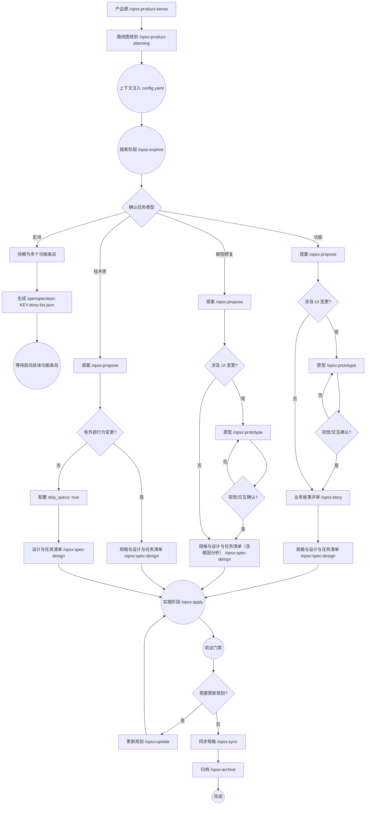

# OpenSpec SDD Workflow SOP (v2.0)

本文档定义了 OpenSpec-Practice 项目的规格驱动开发 (Spec-Driven Development, SDD) 标准操作程序。所有参与此项目的 AI Agent 必须严格遵循本流程。

## 核心阶段与指令

项目统一使用 `/opsx:` 前缀指令（由 Trae 技能提供）。

### 0. 规划层 (Planning Layer) - 全局治理
在进入具体的变更开发前，必须明确产品感与路线图。

- **指令**: `/opsx:product-sense`
  - **目标**: 维护 `docs/PRODUCT_SENSE.md`，明确 Elevator Pitch 和产品原则。
- **指令**: `/opsx:product-planning`
  - **目标**: 维护 `docs/ROADMAP.md`，执行每月滚动计划。
- **业务基线管理 (Auxiliary Baseline Commands)**:
  - **指令**: `/opsx:baseline/journey` - 维护 `docs/baseline/HIGH_LEVEL_JOURNEY.md`。
  - **指令**: `/opsx:baseline/story-map` - 维护 `docs/baseline/STORY_MAP.md`。
  - **指令**: `/opsx:baseline/process-flow` - 维护 `docs/baseline/CORE_BUSINESS_PROCESS_FLOW.md`。
  - **指令**: `/opsx:baseline/domain-model` - 维护 `docs/baseline/DOMAIN_MODEL.md` (Event-Storming 视角)。
  - **指令**: `/opsx:baseline/render` - 将上述 Markdown 基线渲染为 HTML。
- **强制约束**:
  - 规划层产物是全局上下文，将自动注入所有后续指令。
  - 必须包含“未来 +1, +2 个月”的滚动预测。

### SDD 动态分支工作流
为确保各类型任务的遵循性，OpenSpec 流程根据任务类型进行动态分支。请所有参与项目的 AI Agent **严格根据下方流程图中的条件分支**执行必须步骤和可选步骤：



### 1. 探索阶段 (Explore)
- **指令**: `/opsx:explore`
- **目标**: 在没有任何制品前，通过对话澄清需求，探索代码库，权衡方案。
- **强制约束 (Hard Constraint)**:
  - 必须严格遵循“结构化 6 步法”。
  - **任务类型确认 (Task Classification)**: 必须确认是史诗、功能、缺陷修复还是技术债。
  - **规划对齐 (Roadmap Alignment)**: 在 `ideas/idea.md` 中必须显式写一段“与当前阶段目标对齐说明”，引用 `docs/ROADMAP.md` 中的目标。
  - **史诗治理**: 如果是史诗，必须在 `openspec/` 目录下创建一个 `epic-<key>.story-list.json` 文件作为执行队列。
  - **唯一输出**: 必须生成 `ideas/idea.md` (相对于变更目录) 作为后续提案的唯一源头。
  - 不得在没有 `ideas/idea.md` 的情况下跳过此阶段进入提案。
  
### 2. 提案阶段 (Propose)
- **指令**: `/opsx:propose <name>`
- **目标**: 根据 `idea.md` 生成变更提案 `proposal.md`。
- **强制约束 (Hard Constraint)**:
  - 必须基于 `idea.md` 的任务类型明确后续路径。
  - 对于史诗类型，生成提案后应停止，等待拆分。
  - 对于功能类型，引导用户进入下一步（涉及 UI 先 `/opsx:prototype` 并完成确认，再 `/opsx:story`，随后进入 `/opsx:spec-design`；不涉及 UI 则直接 `/opsx:story`，随后进入 `/opsx:spec-design`）。
  - 对于缺陷修复类型，引导用户进入下一步（涉及 UI 先 `/opsx:prototype` 并完成确认，随后进入 `/opsx:spec-design`；不涉及 UI 则直接进入 `/opsx:spec-design`，并在设计中包含根因分析）。
  - 对于技术债类型，引导用户进入下一步（若有外部行为变更则进入 `/opsx:spec-design`；若无外部行为变更则配置 `skip_specs: true`，生成设计与任务清单后再进入 `/opsx:apply`）。
  
### 3. 原型验证阶段 (Prototype) - 可选
- **指令**: `/opsx:prototype <name>`
- **目标**: 为功能或涉及 UI 变更的缺陷修复生成交互式 HTML 原型。
- **强制约束 (Hard Constraint) - HITL 检查点**:
  - 生成原型后，必须通过 `AskUserQuestion` 获取人类确认。
  - 原型是 UI 逻辑的唯一事实来源，确认后方可进入下一步。

### 4. 业务评审阶段 (Story)
- **指令**: `/opsx:story <name>`
- **目标**: 生成端到端的验收文档 `story.md`。
- **强制约束 (Hard Constraint)**:
  - **时机**: 必须在提案之后执行；若涉及 UI，必须在原型确认后执行。
  - **内容**: 必须包含跨模块的 E2E 旅程及业务规则表。
  - **HITL 检查点**: 生成后必须由用户确认验收标准，方可进入模块规格设计。

### 5. 规范与设计阶段 (Spec-Design)
- **指令**: `/opsx:spec-design <name>`
- **目标**: 一口气生成 `specs`、`design.md` 和 `tasks.md`。
- **BDD 测试分层防腐**: 在生成 `spec.md` 时，必须为每个 Gherkin Scenario 打上测试标签 (`@unit`, `@api`, 或 `@e2e`)，严格遵循[自动化测试策略](../TESTING_STRATEGY.md)。
- **强制约束 (Hard Constraint)**:
  - 必须参考已确认的 `proposal.md` 和 `prototype.html` (若有)。如果存在 `story.md`，必须确保 specs 与其 E2E 验收标准一致。
  - 生成的任务清单必须包含 E2E 验证步骤。

### 6. 应用阶段 (Apply)
- **指令**: `/opsx:apply`
- **目标**: 基于生成的 `tasks.md` 逐项实施代码变更。
- **工作流**: 
  - 动态读取 `tasks.md` 中的复选框，完成一项则将 `- [ ]` 标记为 `- [x]`。
  - **测试驱动实现 (TDD/BDD)**: 必须严格按照 `spec.md` 上的标签 (`@unit`, `@api`, `@e2e`) 编写对应的测试代码。对于 `@e2e` 任务，必须在全局 `e2e-tests/` 目录中完成 Cucumber 步骤。
  - **强制门禁 (Hard Gates)**: 开始实现前必须通过 `openspec validate --change "<name>"`，并在 `openspec/changes/<name>/verify.md` 初始化验证证据
  - **强制门禁 (Hard Gates)**: 全部任务勾选完成后必须运行 `/opsx:verify <name>`，确保 Node 测试、Python 测试与前端构建均为 PASS，并将结果写入 `verify.md`
  - **建议门禁 (Soft Gates)**: E2E 建议运行 `./init.sh e2e:run`，失败时必须在 `verify.md` 记录失败摘要与原因

### 7. 更新阶段 (Update) - 可选
- **指令**: `/opsx:update`
- **目标**: 当实施过程中发现需要修改规划（如 specs 或 design）时使用。
- **原则**: 先修改规格/设计，通过验证后，再继续 `/opsx:apply`。

### 8. 同步阶段 (Sync)
- **指令**: `/opsx:sync`
- **目标**: 在归档前，将增量规格 (delta specs) 同步合并入主规格 (main specs)，并同步回流业务基线 (Baseline Sync)。
- **核心动作**:
  1. **Spec Sync**: 将 `openspec/changes/<name>/specs/` 下的变更同步至 `openspec/specs/`。
  2. **Baseline Sync**: 自动调用辅助技能，将 `story.md`、`design.md` 等沉淀的认知回流至 `docs/baseline/` 下的 4 份基线文档。
  3. **Auto Render**: 同步完成后自动执行渲染，刷新 `docs/baseline/` 下的可视化文档。

### 9. 归档阶段 (Archive)
- **指令**: `/opsx:archive`
- **目标**: 将已完成的变更（包含测试）移至归档目录。
- **流程**:
  - **全局 BDD 测试门禁**: 归档前必须运行 `init.sh e2e:run`，确保全局 Cucumber 测试通过。
  - 归档前必须确保已经完成过 `sync`。
  - **技术债登记**: 登记本次变更遗留的技术债。
  - 移动路径: `openspec/changes/<name>/` -> `openspec/changes/archive/YYYY-MM-DD-<name>/`。

## Epic 队列管理 (Backlog Management)

当 Explore 阶段识别为 Epic 时，引入 `openspec/epic-<key>.story-list.json` 进行跨 change 编排。

### 1. JSON 结构规范
```json
{
  "epicKey": "coupon-system",
  "stories": [
    {
      "storyKey": "coupon-create",
      "status": "planned",
      "changeName": null
    }
  ]
}
```

### 2. 状态流转
- **Explore**: 创建文件，登记所有拆解出的 Story，状态为 `planned`。
- **Propose**: AI 自动读取第一个 `planned` 状态的 Story 并建议启动。启动后更新状态为 `in_progress` 并记录 `changeName`。
- **Archive**: 归档完成后，AI 更新该 Story 状态为 `done`，并提示下一个 `planned` 任务。
- **销毁**: 当所有 Story 状态均为 `done` 时，AI 自动删除该 `story-list.json` 文件（无需归档）。

## 异常处理与防漂移
- **Schema 优先**: `openspec/schemas/spec-driven.yaml` 是每个制品的生成说明 (Instruction) 和内容格式的唯一事实来源。如果 SOP 描述与 Schema 有出入，请以 Schema 为准。
- **MANDATORY CHECK**: 如果直接收到 `/opsx:propose`，但 `idea.md` 不存在或未达标，必须强制退回 `/opsx:explore` 阶段。
