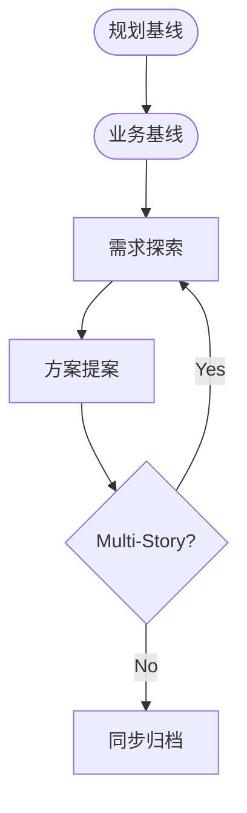
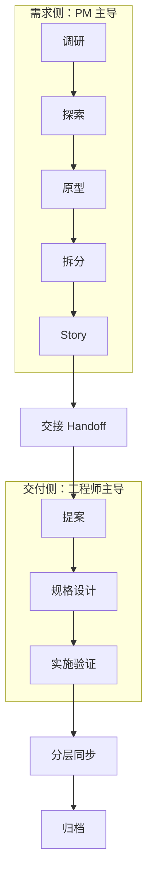

# 演讲大纲：《从 PRD 到 Specs：智能开发时代的需求工程重塑》

## 01 背景与现状：交付瓶颈的深度漂移

### Slide 1｜封面
- **主题**：从 PRD 到 Specs —— 智能开发时代的需求工程重塑
- **核心逻辑**：编码自动化之后，需求环节如何不再成为交付的 Blocker
- **定位**：面向产品经理、BA、项目经理及管理者的研发效能升级指南

### Slide 2｜新现实：自动化编码之后，交付约束转向“需求工程能力”
- **核心洞察**：
    - 大模型显著抬高了实现吞吐（代码生成、样板搭建、重构与迁移）的上限。
    - 在大型组织里，延期与返工更常由“需求不可验证、变更不可控、影响不可追溯”触发，而不是写代码慢。
    - **典型症状**：需求、设计、实现与测试工件分散在不同系统，缺少端到端可追溯链路，导致变更影响分析成本高、易漏项。
- **一句话**：稀缺的不是“写出来”，而是**可追溯、可测试、可审计的需求定义与验收口径**。

### Slide 3｜痛点诊断：需求工程缺少组织级的“质量标准与门禁”
- **核心问题（大组织高频）**：
    - **条目不可管理**：需求以段落叙事为主，缺少可唯一标识的需求条目、优先级与决策依据，难以拆分/对账/复用。
    - **验收不可测试**：缺少清晰的验收准则与边界条件，测试与研发只能凭经验补齐，偏差往往在联调/验收才暴露。
    - **变更不可控**：需求频繁调整但缺少规范的变更控制与影响分析，跨团队协作时“改了但没人知道/不知道影响谁”。
    - **可追溯性不足**：需求与设计、实现、测试之间缺少稳定链接，导致合规审计、回归范围、问题追根溯源成本高。
- **结论**：需求工程要从“写 PRD”升级为“过工序 + 有门禁”，把不确定性前置消解。

### Slide 4｜趋势演进：从“模糊叙事”转向“可执行契约”
- **演进路径**：
    - **过去**：PRD 往往以叙事性说明为主，信息密度高但结构化弱：需求点不条目化、验收口径不明确、变更与决策难以审计。
    - **未来**：Specs（规格）是写给智能系统执行的“工程契约”，必须精确，支持校验。
- **关键特征**：
    - **结构化**：可分类、可分层、可机读。
    - **可验证**：每一个需求点都有明确的断言与验收标准。
    - **自演进**：随代码同步变更，而非游离于研发链路之外。

### Slide 5｜议程概览：需求不再是 Blocker 的四条处方
1. **分类治理**：解耦不同性质的需求路径
2. **工序标准化**：构建从想法到规格的确定性漏斗
3. **知识资产化**：将需求沉淀为可复用的研发基线
4. **智能倍增**：利用 AI 放大专家的定义效能

---

## 01.5 进化可视化：OpenSpec 的成长之路

> **提示**：为了获得最佳视觉体验，请查看 [OpenSpec 工作流演进全景图 (High-Fidelity)](file:///Users/superkkk/MyCoding/OpenSpec-practice/docs/visuals/workflow-evolution.html)。

### 阶段一：v1.5 极简版（线性敏捷）
专注于快速闭环，确立了“意图 -> 规格 -> 代码”的原始管线。

### 阶段二：轻量版（基线与循环）
引入了“基线 (Baseline)”概念，支持 Multi-Story 循环迭代，解决了复杂业务逻辑的拆解问题。

### 阶段三：v2.0 完整版（解耦工程化）
实现了需求侧与交付侧的深度解耦，通过标准化漏斗与分层同步，支持规模化协作。

---

## 02 机理诊断：需求为何成为唯一的 Blocker？

### Slide 6｜结构性缺陷：“大单体”PRD 的交付瓶颈
- **问题现状**：需求被视为一个整体项目，采用“写完 -> 评审 -> 确认”的串行模式。
- **瓶颈点**：
    - **全量等待**：PRD 中任何一个细节的不确定，都会阻塞整篇文档的签发。
    - **串行阻塞**：评审与修改全在关键路径上，无法实现增量交付。
    - **反馈滞后**：需求歧义/漏项往往要到联调、测试或 UAT 才暴露，此时返工会跨越设计、实现、测试与文档多条链路。

### Slide 7｜规模化难题：对个人经验的过度依赖
- **深度剖析**：
    - 团队的产能上限，取决于少数高年级 PM/BA 的“脑力带宽”。
    - 需求质量的稳定性极差——由于缺乏统一的工程底座，新手与老手的产出差异巨大。
    - 专家 PM 往往沦为“人肉翻译机”，在跨团队对齐中消耗了大量精力，无法聚焦于业务价值的深度抽象。
- **金句**：不能规模化的专家经验，本质上是研发效能的**单点故障**。

### Slide 8｜认知误区：被忽视的“事务性操作”负担
- **职能拆解**：
    - **创造性思考**（抽象、决策、优先级、价值判断）：慢，且必须由人类完成。
    - **事务性操作**（整理访谈记录、编写验收标准、对齐术语、维护文档格式）：快，且可被工具与 AI 替代。
- **现状**：产品经理 70% 的时间被“事务性操作”占据，导致核心的“创造性思考”被极度压缩，需求因“想不清楚”而变慢。

### Slide 9｜第一性原理：从关注“单条速度”转向“系统吞吐”
- **核心逻辑**：
    - 单条需求的“思考时间”受限于决策复杂度，压缩空间有限。
    - **解法**：通过**分流与解耦**，将单一的串行路径转化为多条并行的标准化管线。
    - **目标**：提升研发链路的“单位时间产出（吞吐量）”，而非单纯追求单体需求的交付速度。

---

## 03 解法一：分类治理——按需定义交付路径

### Slide 10｜差异化判定：探索型、规则型与联动型
- **核心逻辑**：并非所有需求都应遵循同一套流程。
- **分类标准**：
    - **探索型**：目标明确但方案未定。重点在于“原型验证”与“意图澄清”。
    - **规则型**：方案明确但规则密集。重点在于“边界梳理”与“验收断言”。
    - **联动型**：涉及跨模块协作。重点在于“影响分析”与“契约对齐”。
- **价值**：让简单需求直走交付，让复杂需求深度受控，彻底消灭“小需求排队等大流程”的现象。

### Slide 11｜架构隔离：业务语义与验收侧，与交付执行侧的解耦
- **解耦方案**：
    - **需求侧（PM/BA 主导）**：产出可验收的业务语义与规则边界（场景、约束、验收口径、优先级）。
    - **交付侧（工程师主导）**：在不改变业务语义的前提下，负责技术方案、实现与自动化验证，并将变更同步回规格资产库。
- **收益**：
    - **并行推进**：业务面一旦冻结，即可触发后续链路，不必等待整包 PRD 完稿。
    - **变更隔离**：交付侧的技术演进不应反复冲击已冻结的业务语义与验收口径。

### Slide 12｜资产分层：L1 语义、L2 契约与 L3 规格
- **模型定义**：
    - **L1 语义层**：对齐“做什么、为什么”，定义核心业务规则与用户旅程。
    - **L2 契约层**：定义“什么行为算正确”，形成可被 AI 和测试消费的规格断言。
    - **L3 规格层**：拆解“怎么做”，描述架构变更与任务细节。
- **专家洞察**：分层不是为了增加文档，而是为了**明确每一层的拥有者与冻结时机**，防止认知混乱。

### Slide 13｜按需建设：投入产出比的最优平衡
- **策略**：
    - 核心业务、高频变更区：三层建满，强化资产沉淀。
    - 边缘功能、简单修改：轻量化路径，直达交付。
- **金句**：工程化的本质是**有选择的深度**，而不是盲目的全面。

---

## 04 解法二：工序标准化——构建确定性漏斗

### Slide 14｜从“写文档”到“过工序”：需求漏斗的标准化阶段
- **工序定义**：
    1. **调研（Research）**：只收集事实，不转化方案。
    2. **探索（Explore）**：明确业务流程与候选能力。
    3. **原型（Prototype）**：具象化交互，消除理解偏差。
    4. **拆分（Storymap）**：拆解交付单元，完成覆盖对账。
    5. **冻结（Story）**：沉淀业务规则与验收标准。
- **核心价值**：每一步都有明确的“产出物”与“准入准出标准”，实现需求加工的流水线化。

### Slide 15｜关键纪律：只收集不转化与原型对齐
- **事实与解读分离**：在调研阶段强迫“只记录原始访谈/数据”，防止过早进入方案设计导致的认知闭塞。
- **原型的本质**：不是为了 UI 的美观，而是为了实现**最低成本的共识**——让分歧发生在交互演示中，而非上线后。
- **专家判断**：原型确认过的交互 + 显式排除的边界 = 研发范围的硬契约。

### Slide 16｜覆盖对账：消灭“以为做了其实没做”的盲区
- **对账逻辑**：在需求拆分环节，强制将“原始承诺项”与“交付 Story”进行逐一关联。
- **管理收益**：
    - 防止需求漏项（承诺未承接）。
    - 防止范围蔓延（承接无承诺）。
    - 建立需求范围的“可审计清单”。

### Slide 17｜最小冻结单元：解耦等待的开关
- **机制**：以 Story 而非 Epic 为最小冻结单元。
- **并行逻辑**：一个 Story 的业务规则一旦冻结，立即进入开发侧“交接（Handoff）”，后续 Story 继续在需求侧加工。
- **结论**：**冻结单位越小，等待链条越短**，研发与需求两条管线才能真正并行。

---

## 05 解法三：知识资产化——沉淀研发基线

### Slide 18｜Handoff：从“文档抛接”到“语义交接”
- **交接产物**：不再是一份文档，而是一份**“变更影响声明”**。
- **内容构成**：
    - **业务关联**：链接至已冻结的 Story 资产。
    - **影响范围**：显式标注涉及的业务能力与架构模块。
    - **治理对齐**：映射至全局业务流程与服务蓝图。
- **意义**：为后续的 AI 自动化生成与一致性校验提供结构化的“种子”。

### Slide 19｜业务 Context 经营：管理看不见的确定性
- **经营清单**：
    - **术语表**：唯一定义业务词汇，杜绝概念漂移。
    - **边界声明**：明确 In-Scope 与 Out-of-Scope。
    - **异常语义**：将安全校验、边界错误沉淀为业务层规则，而非代码补丁。
- **价值**：需求工程管的不仅是功能，更是**领域语义的守恒**。

### Slide 20｜活文档与分层同步策略
- **同步机制**：
    - **变更级同步**：每个功能变更完成后，立即回流至主规格资产库。
    - **基线级同步**：每个业务阶段（Epic）结束后，更新全局业务蓝图。
- **目标**：保证文档与代码的实时同步，彻底解决“文档即谎言”的行业顽疾。

---

## 06 解法四：智能倍增——释放专家效能

### Slide 21｜AI 乘数：吃掉事务性操作，放大专家决策
- **AI 介入点**：
    - **生成**：基于业务草案自动生成规格草稿与验收场景。
    - **校验**：自动检查需求规则之间的一致性，揪出逻辑冲突。
    - **分析**：顺着治理映射自动枚举变更的影响面。
- **角色转变**：PM 从“打字员”转变为“**语义架构师**”，只负责核心结构的定义与 HITL（人工确认）决策。

### Slide 22｜闭环协同：研发缺口的回流机制
- **协同规则**：实操中发现的需求缺口（如未定义的边界场景），应通过标准化通道回流至需求管线。
- **价值**：避免开发人员“顺手拍板”导致的需求漂移，确立需求侧为业务语义的唯一事实来源。

---

## 07 总结与展望：角色重塑

### Slide 23｜核心回顾：解开 Blocker 的四把钥匙
1. **分类治理**：路径解耦，消除排队。
2. **工序标准**：阶段确定，消除反复。
3. **知识资产**：基线稳固，消除漂移。
4. **智能倍增**：效能释放，消除瓶颈。

### Slide 24｜行动建议：如何起步？
- **第一步**：挑选一个规则密集的模块，尝试从“叙事 PRD”改写为“分层规格”。
- **第二步**：建立需求管线的 WIP（在制数）与 Lead Time 指标，让阻塞显形。
- **第三步**：在需求拆分中引入“覆盖对账”机制，守住范围底线。

### Slide 25｜展望：AI 时代的需求工程
- **未来图景**：需求不再是研发的“后勤”，而是整个自动化产线的**“导航系统”**。
- **金句**：好的结构让 80% 的产出接近正确，剩下的 20% 留给专家的智慧。
