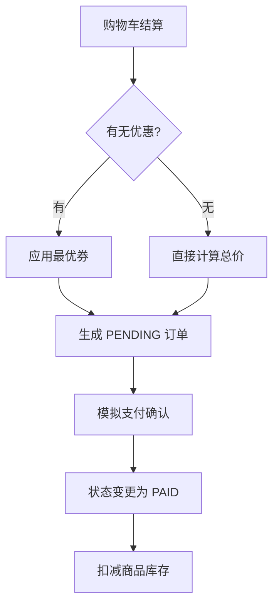

# Core Business Process Flow 基线

## Purpose
描述跨角色、跨模块的核心业务流程与状态流转逻辑。

## 核心流程定义

### 1. 交易订单流转图 (Order Lifecycle)

### 2. 优惠券生命周期 (Coupon Lifecycle)
- **Draft**: 后台创建，尚未生效
- **Active**: 已发布，用户可领取
- **Used**: 用户已核销，关联具体订单
- **Expired**: 超过有效期，不可使用

---
*Last Updated: 2026-08-19*
