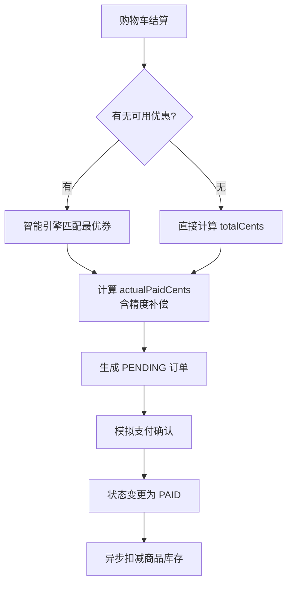

# Core Business Process Flow 基线

## Purpose
描述跨角色、跨模块的核心业务流程与状态流转逻辑。

## 核心流程定义

### 1. 交易订单流转图 (Order Lifecycle)

### 2. 优惠券生命周期 (Coupon Lifecycle)
- **Draft**: 后台创建，尚未生效。
- **Active**: 已发布，用户可领取或全场自动适用。
- **Used**: 用户已核销，状态与 `actualPaidCents` 锁定，关联具体订单。
- **Expired**: 超过有效期，计算引擎将自动忽略。

### 3. 财务精度控制策略
- **输入**: 原始金额 (cents)。
- **逻辑**: 对于百分比折扣，计算结果执行 `+ 0.00001` 补偿后向下取整。
- **输出**: 最终 `actualPaidCents` (整数)。

---
*Last Updated: 2026-08-19*
