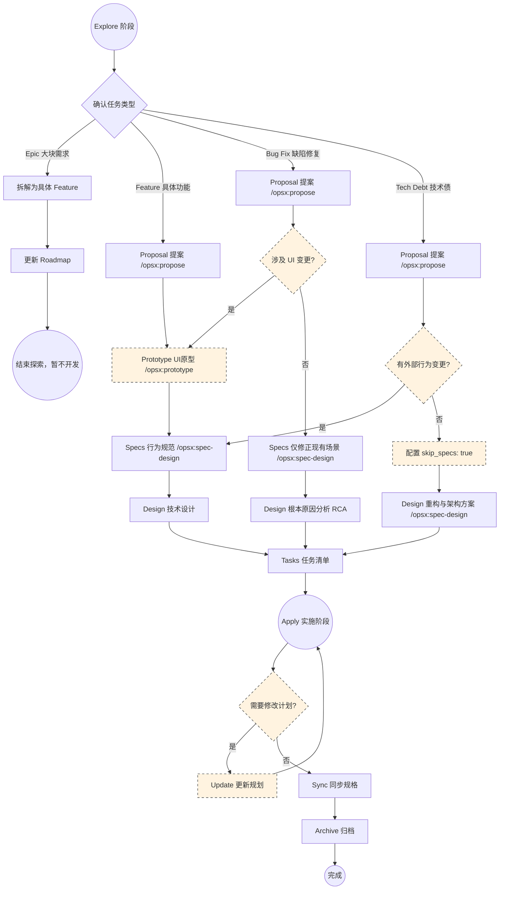

# OpenSpec SDD Workflow SOP (v1.8.0)

本文档定义了 OpenSpec-Practice 项目的规格驱动开发 (Spec-Driven Development, SDD) 标准操作程序。所有参与此项目的 AI Agent 必须严格遵循本流程。

## 核心阶段与指令

项目统一使用 `/opsx:` 前缀指令（由 Trae 技能提供）。

### SDD 动态分支工作流 (Workflow Branching)
为确保各类型任务的遵循性，OpenSpec 流程根据任务类型 (Task Type) 进行动态分支。请所有参与项目的 AI Agent **严格根据下方流程图中的条件分支**执行必须步骤和可选步骤：

### 1. 探索阶段 (Explore)
- **指令**: `/opsx:explore`
- **目标**: 在没有任何制品前，通过对话澄清需求，探索代码库，权衡方案。
- **强制约束 (Hard Constraint)**:
  - 必须严格遵循“结构化 6 步法”。
  - **任务类型确认 (Task Classification)**: 必须确认是 Epic, Feature, Bug Fix 还是 Tech Debt。
  - **唯一输出**: 必须生成 `openspec/changes/ideas/idea.md` 作为后续提案的唯一源头。
  - 不得在没有 `idea.md` 的情况下跳过此阶段进入提案。

### 2. 提案阶段 (Propose)
- **指令**: `/opsx:propose <name>`
- **目标**: 根据 `idea.md` 生成变更提案 `proposal.md`。
- **强制约束 (Hard Constraint)**:
  - 必须基于 `idea.md` 的任务类型明确后续路径。
  - 对于 Epic 类型，生成提案后应停止，等待拆分。
  - 对于其他类型，引导用户进入下一步（`/opsx:prototype` 或 `/opsx:spec-design`）。

### 3. 原型验证阶段 (Prototype) - 可选
- **指令**: `/opsx:prototype <name>`
- **目标**: 为 Feature 或涉及 UI 的 Bug Fix 生成交互式 HTML 原型。
- **强制约束 (Hard Constraint) - HITL 检查点**:
  - 生成原型后，必须通过 `AskUserQuestion` 获取人类确认。
  - 原型是 UI 逻辑的唯一事实来源，确认后方可进入下一步。

### 4. 规范与设计阶段 (Spec-Design)
- **指令**: `/opsx:spec-design <name>`
- **目标**: 一口气生成 `specs`、`design.md` 和 `tasks.md`。
- **BDD 测试分层防腐**: 在生成 `spec.md` 时，必须为每个 Gherkin Scenario 打上测试标签 (`@unit`, `@api`, 或 `@e2e`)，严格遵循[自动化测试策略](../TESTING_STRATEGY.md)。
- **强制约束 (Hard Constraint)**:
  - 必须参考已确认的 `proposal.md` 和 `prototype.html` (若有)。
  - 生成的任务清单必须包含 E2E 验证步骤。

### 5. 应用阶段 (Apply)
- **指令**: `/opsx:apply`
- **目标**: 基于生成的 `tasks.md` 逐项实施代码变更。
- **工作流**: 
  - 动态读取 `tasks.md` 中的复选框，完成一项则将 `- [ ]` 标记为 `- [x]`。
  - **测试驱动实现 (TDD/BDD)**: 必须严格按照 `spec.md` 上的标签 (`@unit`, `@api`, `@e2e`) 编写对应的测试代码。对于 `@e2e` 任务，必须在全局 `e2e-tests/` 目录中完成 Cucumber 步骤。

### 6. 更新阶段 (Update) - 可选
- **指令**: `/opsx:update`
- **目标**: 当实施过程中发现需要修改规划（如 specs 或 design）时使用。
- **原则**: 先修改规格/设计，通过验证后，再继续 `/opsx:apply`。

### 7. 同步阶段 (Sync)
- **指令**: `/opsx:sync`
- **目标**: 在归档前，将增量规格 (delta specs) 同步合并入主规格 (main specs)。

### 8. 归档阶段 (Archive)
- **指令**: `/opsx:archive`
- **目标**: 将已完成的变更（包含测试）移至归档目录。
- **流程**:
  - **全局 BDD 测试门禁**: 归档前必须运行 `init.sh e2e:run`，确保全局 Cucumber 测试通过。
  - 归档前必须确保已经完成过 `sync`。
  - **技术债登记**: 登记本次变更遗留的技术债。
  - 移动路径: `openspec/changes/<name>/` -> `openspec/changes/archive/YYYY-MM-DD-<name>/`。

## 异常处理与防漂移
- **Schema 优先**: `openspec/schemas/spec-driven.yaml` 是每个制品的生成说明 (Instruction) 和内容格式的唯一事实来源。如果 SOP 描述与 Schema 有出入，请以 Schema 为准。
- **MANDATORY CHECK**: 如果直接收到 `/opsx:propose`，但 `idea.md` 不存在或未达标，必须强制退回 `/opsx:explore` 阶段。
