# 轻量级 SDD 总体流程 v2 草案（讨论稿）

> **状态**: 🔄 讨论中（Draft，未落盘到正式提案）
> **目的**: 刷新 `ai4se-lightweight-sdd-proposal.md` 第 2.2 节「Working Loop」流程图，对齐最新 req-sdd v2 架构（需求侧 / 交付侧两级解耦）
> **关联**: `openspec-requirements/`（需求侧）、`openspec/`（交付侧）、`docs/SOPS/SDD_WORKFLOW.md`

---

## 1. 为什么需要刷新

原提案的 Working Loop 流程图描述的是**旧版流程**：

```
规划基线 → 业务基线 → /opsx:explore → /opsx:propose → [开发侧: prototype → story → 规格设计...] → sync → archive
```

旧流程把需求探索、原型、业务故事全部放在开发侧 change 循环内，**没有**：
- 需求侧 / 交付侧的两级隔离
- 适用范围路由（Epic 走需求漏斗，Bug Fix / Tech Debt / 简单功能直走交付侧）
- 交接边界（handoff 合成开发侧 proposal）

最新 v2 架构已将需求阶段独立为 `openspec-requirements/`（PM 主导，仅大块 Epic），交付侧从 proposal 起步，行为规格（Story-specs）由开发侧按 capability 生成。

---

## 2. 刷新后的总体流程（草案 Mermaid）

> 图例：每个节点标注 `command · skill · 产物`。需求侧命令空间 `/req:`，交付侧 `/opsx:`，规划层 `/opsx:planning:`。`+HITL` = 该节点产出需人工确认（Human in the Loop 门禁），粗粒度阶段尤其需要。

```mermaid
flowchart TD
    %% ===== 基线层 =====
    A([规划基线<br/>/opsx:planning:product-sense<br/>/opsx:planning:product-planning<br/>PRODUCT_SENSE / ROADMAP])
    B([业务基线<br/>/opsx:baseline/sync<br/>domain_model / business_process / service_blueprint])

    %% ===== 适用范围路由 =====
    R{适用范围路由<br/>任务类型?}

    %% ===== 需求侧 =====
    subgraph ReqSide [需求侧 · 仅大块 Epic · PM 主导]
        direction TB
        P1[需求调研 +HITL<br/>/req:research · skill: research<br/>→ research.md（针对单个 Epic 收集需求）]
        P2[探索 +HITL<br/>/req:explore · skill: explore<br/>→ idea.md（业务设计：<br/>To-Be Process / To-Be Journey /<br/>产品设计思路）<br/>+ 识别候选 Capabilities<br/>（对齐 domain_model BC→Capability）]
        P4{涉及 UI?}
        P5[原型设计（Epic 整体）+HITL<br/>/req:prototype · skill: prototype<br/>→ prototypes/*.html]
        P3[需求拆分 +HITL<br/>/req:storymap · skill: storymap<br/>→ storymap.md（覆盖对账·端到端粒度）]
        P6[Story 交付物 +HITL<br/>/req:story · skill: story<br/>→ story.md（业务面）]
    end

    %% ===== 交接边界 =====
    subgraph Handoff [交接边界]
        H1[handoff<br/>/req:handoff · skill: handoff<br/>→ 合成开发侧 proposal.md]
    end

    %% ===== 交付侧 =====
    subgraph DevSide [交付侧 · Engineer 主导]
        direction TB
        D1[提案<br/>/opsx:propose · skill: openspec-propose<br/>→ proposal.md（handoff 合成 或 直走）]
        D2[行为规格<br/>/opsx:spec-design · skill: openspec-spec-design<br/>→ specs/*.md（Story-specs·按 capability·h3/h4）]
        D3[设计<br/>/opsx:spec-design · skill: openspec-spec-design<br/>→ design.md + tasks.md]
        D4[实施与验证 +HITL<br/>/opsx:apply · skill: openspec-apply-change<br/>→ 代码 + verify.md<br/>/opsx:verify · skill: openspec-verify]
    end

    %% ===== 收尾层 =====
    K1[Spec Sync · change 级<br/>/opsx:sync · skill: openspec-sync-specs<br/>→ delta specs 合并入 openspec/specs]
    L([变更归档<br/>/opsx:archive · skill: openspec-archive-change<br/>→ 归档 + epic 队列更新])
    K2[Baseline Sync +HITL · Epic 级<br/>/opsx:baseline/sync · skill: baseline/*<br/>→ 统一回流 docs/baseline + ROADMAP]
    M[周期回顾<br/>/opsx:planning:product-planning · skill: openspec-product-planning<br/>→ 更新 ROADMAP]

    %% ===== 流程连接 =====
    A ==> B
    B ==> R

    R -- 大块 Epic --> P1
    R -- Bug Fix / Tech Debt / 简单功能 --> D1

    P1 ==> P2
    P2 ==> P4
    P4 -- 是 --> P5
    P4 -- 否 --> P3
    P5 --> P3
    P3 ==> P6
    P6 ==> H1
    H1 ==> D1

    D1 ==> D2
    D2 ==> D3
    D3 ==> D4
    D4 ==> K1
    K1 ==> L

    L -- 该 Epic 还有下一个 Story --> P6
    L -- 该 Epic 全部 Story 已完成 --> K2
    K2 -.-> B
    K2 ==> M
    M -.-> A

    %% ===== 样式定义 =====
    classDef baseline fill:#bbdefb,stroke:#0d47a1,stroke-width:2px,color:#0d47a1
    classDef logic fill:#fff3e0,stroke:#e65100,stroke-width:2px,color:#e65100
    classDef decision fill:#e8f5e9,stroke:#2e7d32,stroke-width:2px,color:#1b5e20
    classDef impl fill:#f3e5f5,stroke:#7b1fa2,stroke-width:2px,color:#4a148c
    classDef archive fill:#f5f5f5,stroke:#9e9e9e,stroke-width:2px,color:#616161

    class A,B baseline
    class R,P4 decision
    class P1,P2,P3,P5,P6,H1,K1,K2 logic
    class D1 logic
    class D2,D3,D4 impl
    class L,M archive

    style ReqSide fill:#e8f5e9,stroke:#2e7d32,stroke-dasharray: 5 5
    style Handoff fill:#fff8e1,stroke:#f57f17,stroke-dasharray: 5 5
    style DevSide fill:#f3e5f5,stroke:#7b1fa2,stroke-dasharray: 5 5
```



### 节点 × 命令 × Skill × 产物 对照表

| 节点 | 环节 | 命令 | Skill | 产物 | 主导 |
| --- | --- | --- | --- | --- | --- |
| A | 规划基线（**起点即含 roadmap**：按阶段·每阶段多 Epic） | `/opsx:planning:product-sense` / `/opsx:planning:product-planning` | `openspec-product-sense` / `openspec-product-planning` | `PRODUCT_SENSE.md` / `ROADMAP.md` | PM |
| B | 业务基线 | `/opsx:baseline/sync` | `openspec-baseline-*`（4 个） | `domain_model.html` / `business_process.html` / `service_blueprint.html` | PM/Lead |
| R | 适用范围路由 | —（决策点） | — | 分流：Epic→需求侧；其余→交付侧 | Lead |
| P1 | 需求调研 | `/req:research` | `research` | `research.md`（针对起点 ROADMAP 中的单个 Epic） | PM |
| P2 | 探索 | `/req:explore` | `explore` | `idea.md`（**含业务设计：To-Be Process / To-Be Journey / 产品设计思路 + 识别候选 Capabilities**） | PM |
| P4 | UI 决策 | —（决策点） | — | — | PM |
| P5 | 原型设计（Epic 整体） | `/req:prototype` | `prototype` | `prototypes/*.html`（HITL，一次完成） | PM |
| P3 | 需求拆分 | `/req:storymap` | `storymap` | `storymap.md`（覆盖对账） | PM |
| P6 | Story 交付 | `/req:story` | `story` | `story.md`（业务面·HITL） | PM |
| H1 | 交接 | `/req:handoff` | `handoff` | 合成开发侧 `proposal.md` | Lead/PM |
| D1 | 提案 | `/opsx:propose` | `openspec-propose` | `proposal.md` | Engineer |
| D2 | 行为规格 | `/opsx:spec-design` | `openspec-spec-design` | `specs/*.md`（Story-specs） | Engineer |
| D3 | 设计 | `/opsx:spec-design` | `openspec-spec-design` | `design.md` + `tasks.md` | Engineer |
| D4 | 实施与验证 | `/opsx:apply` → `/opsx:verify` | `openspec-apply-change` / `openspec-verify` | 代码 + `verify.md` | Engineer |
| K1 | Spec Sync（change 级） | `/opsx:sync` | `openspec-sync-specs` | delta specs 合并入 `openspec/specs` | Lead |
| L | 归档 | `/opsx:archive` | `openspec-archive-change` | 归档 change + epic 队列更新 | Lead |
| K2 | Baseline Sync（Epic 级） | `/opsx:baseline/sync` | `openspec-baseline-*`（4 个） | 统一回流 `docs/baseline/*.html` | Lead |
| M | 周期回顾 | `/opsx:planning:product-planning` | `openspec-product-planning` | 更新 `ROADMAP.md` | PM |

---

## 3. 与旧流程的关键差异

| # | 旧流程 | 新流程 | 对应裁决 |
|---|---|---|---|
| 1 | 无适用范围路由，所有任务走同一漏斗 | **`R{适用范围路由}`**：Epic → 需求侧；Bug Fix / Tech Debt / 简单功能 → **直走交付侧** | 裁决 4 |
| 2 | explore / propose 在开发侧 change 内 | **需求侧子图 `ReqSide`**：`P1 需求调研 → P2 探索 → P4{UI?} → P5 原型(Epic整体) → P3 拆分 → P6 Story`（规划在起点 A 已有） | 需求阶段前移、隔离 |
| 3 | prototype / story 在开发侧 Multi-Story Loop 内 | **需求侧内** `P4→P5→P6`（prototype → story），产出 `story.md`（业务面） | 裁决 1 |
| 4 | 无交接边界 | **`Handoff` 子图**：`handoff` **合成开发侧 proposal** | 裁决 2 |
| 5 | 开发侧从规格设计开始 | 开发侧 `D1 proposal → D2 specs(Story-specs) → D3 design → D4 apply/verify` | 行为规格由开发侧按 capability 生成 |
| 5.1 | 同步混在 change 级（spec+baseline 一起） | **分层 Sync**：`K1 Spec Sync`（change 级，每 Story 归档前合并 delta→主规格）+ `K2 Baseline Sync`（**Epic 级**，所有 Story 归档后统一回流 baseline + ROADMAP） | 避免中间态污染 baseline；Roadmap 判定 = Epic Exit Criteria 全达成 |
| 6 | 多 Story 循环回到开发侧 UI 决策 | **`L -- 下一个 Story --> P4`** 回到**需求侧**（storymap 的下一个 Story） | 需求/交付两级循环 |
| 7 | 需求侧有独立「产品规划」步骤产出 roadmap | **删除需求侧规划步骤**：roadmap 已在起点规划基线（A）产出（按阶段·每阶段多 Epic）；需求侧直接从 `P1 需求调研`（针对起点 ROADMAP 中的 Epic）开始 | 消除冗余 |
| 8 | 需求探索用 `openspec-explore`（开发侧） | 需求侧探索改为 **`explore` skill**（= 旧 explore 迁移到需求侧，职责"调研信息 → 产品设计思路"）；`research` skill 重定位为「需求调研」（只负责收集信息） | 消除"req-research 与 explore 重复"缺陷 |
| 9 | skill 名带 `req-` 前缀（req-planning/req-research/...） | **skill 名去掉 `req-`**（research/explore/storymap/prototype/story/handoff）；**命令用 `/req:` 命名空间子目录**（`.trae/commands/req/`、`.cursor/commands/req/`），命令名为 `/req:research`、`/req:explore`、`/req:storymap`、...；需求拆分 skill 名为 **`storymap`**（非 breakdown，与产物同名） | 命名可读性调整 |

---

## 4. 待确认的对齐点

1. **✅ 已调整：需求侧漏斗起点 = `P1 需求调研`**（roadmap 已在起点规划基线 A 产出，按阶段·每阶段多 Epic）；`P1 需求调研`（针对单个 Epic 收集需求）→ `P2 探索`（转化为产品设计思路 idea.md）→ `P3 拆分`。**请确认**。
2. **🔸 命名方案（已更新）**：skill 名去掉 `req-`（research/explore/**storymap**/prototype/story/handoff）；**命令用 `/req:` 命名空间子目录**（`.trae/commands/req/`、`.cursor/commands/req/`），命令名为 `/req:research`、`/req:explore`、`/req:storymap`、`/req:prototype`、`/req:story`、`/req:handoff`。**需求拆分 skill 名定为 `storymap`**（与产物 storymap.md 同名，不用 breakdown）。与现有 `/opsx:baseline/sync`、`/opsx:planning/product-planning` 子目录模式一致。**是否按此方案？**
3. **需求调研的产物形态与粒度**：新增环节产出什么？
   - **粒度**：`research` 针对单个 Epic 做调研（一个 Epic 一次调研），Epic 来自起点 ROADMAP。
   - 方案 A：独立 `research.md` 制品（调研纪要：背景/干系人/原始反馈/约束/疑问）
   - 方案 B：不新建制品，调研信息直接作为 idea.md 第 1 章的输入素材（轻量，但"调研"环节无落点）
   - 方案 C：复用 `idea.md`，但把"调研收集"与"探索转化"分成两篇 idea（过重）
   - 我倾向 A（独立 `research.md`，让"调研收集"有稳定落点）
4. **✅ Multi-Story 循环**：**归档后**判断「还有下一个 Story → 回需求侧 P6」「全部完成 → K2 Baseline Sync」。每个 Story 对应一个独立 change、逐个走完归档；原型/拆分已为 Epic 整体完成，循环内不重做。**已按此更新**。
5. **✅ 非 Epic 路径的 UI 分支**：**不显式画出**，靠 SOP 文字说明（Bug Fix 带 UI 时交付侧先做原型）。
6. **✅ L3/L4 成熟度标注**：**图上标注 `+HITL`**，粗粒度阶段（需求调研 / 探索 / 原型 / 拆分 / Story 交付 / 实施验证 / Baseline Sync）尤其需要。已按此更新。
7. **✅ 子图命名**：保持中文（**需求侧 / 交接边界 / 交付侧**）。已按此更新。

---

## 5. 讨论记录

- **(2026-08-28) 需求调研调整（第一轮）**：需求侧第一步不应叫"Planning"，应叫「需求调研」。已在 §2 图中调整 P1。
- **(2026-08-28) 流程层级澄清（第二轮）**：流程第一步仍是「规划」→ 产出 Epic（一句话描述）；「需求调研」是针对某个 Epic 的调研；「探索 explore」是把调研转化为产品设计思路。图中已修正为 `P0 规划 → P1 需求调研 → P2 探索`。
- **(2026-08-28) 命名缺陷确认（第二轮）**：当前 `req-research` 与旧 `openspec-explore` 重复（同一套 6 步法 + 同类 idea 产物），属设计缺陷。修正方向：`req-research` 重定位为「需求调研」（只收集），探索改名为 `req-explore`（转化）。待用户确认（对齐点 2）。
- **(2026-08-28) roadmap 语义澄清（第三轮）**：`req-planning` 产出的是一份 **roadmap**（阶段计划），按阶段组织；**每个阶段的条目即 Epic**（一句话描述）；**一个阶段可包含多个 Epic**。图中 `P0` 已更新为「roadmap · 按阶段组织 · 每阶段多个 Epic 条目」。隐含含义：`req-research`（需求调研）是**针对单个 Epic** 进行的（对齐点 3 细化）。
- **(2026-08-28) 命名可读性（第四轮）**：用户指出 `req-planning`/`req-research` 等 `req-` 前缀奇怪。初案：skill 名去掉 `req-`，命令名保留 `/opsx:req-*`（因 explore/prototype/story 与开发侧命令冲突）。
- **(2026-08-28) 命令命名空间子目录（第五轮）**：用户进一步优化——命令不用前缀，改放**子目录命名空间** `/req`（`.trae/commands/req/`、`.cursor/commands/req/`），命令名即 `/req:planning`、`/req:research`、`/req:explore`、`/req:breakdown`、`/req:prototype`、`/req:story`、`/req:handoff`。与既有 `/opsx:baseline/sync`、`/opsx:governance/delivery-board` 子目录模式一致。已更新 §2 图，待确认（对齐点 2）。
- **(2026-08-28) P0 规划冗余删除（第六轮）**：用户指出需求侧 P0「规划」步骤多余——roadmap（按阶段·每阶段多 Epic）在**起点规划基线 A 已有**。需求侧不再产 roadmap，直接从 `P1 需求调研`（消费起点 ROADMAP 中的 Epic）开始。图中已删除 P0，`R -- Epic --> P1`。连带影响：`planning` skill / `/req:planning` 命令 / 需求侧 roadmap 产物**全部废弃**；需求侧漏斗起点 = `research`。
- **(2026-08-28) 拆分 skill 改名 storymap（第七轮）**：需求拆分 skill 不叫 `breakdown`，直接叫 **`storymap`**（与产物 `storymap.md` 同名，语义直接）。命令 `/req:storymap`。已更新 §2 图 / 对照表 / 对齐点 2。待确认。
- **(2026-08-28) 原型前置为 Epic 整体（第八轮）**：用户指出原型设计应在需求拆分**之前**——有了 idea 后，**先对 Epic 整体做原型设计**，再进行需求拆分。流程修正为：`P2 探索 → P4{涉及UI?} → P5 原型(Epic 整体·一次) → P3 拆分 → P6 Story`；Multi-Story 循环回到 `P6`（原型/拆分已为 Epic 完成，无需重做）。已更新 §2 图。待确认。
- **(2026-08-28) idea 扩展业务设计（第九轮）**：`explore` 输出的 `idea.md` 需扩展，包含 **To-Be Process（目标流程）、To-Be Journey（目标旅程）** 等业务设计部分（非产品设计思路那么简单）。已在 §2 图 P2 节点与对照表中备注，**暂不实现**，待流程对齐后纳入 `idea.md` 模板扩展设计。
- **(2026-08-28) explore 识别候选 Capabilities（第十轮）**：`explore` 还应识别 **Candidate Capabilities**（对齐 `domain_model.html` 的 BC→Capability 映射，新增 taxonomy 显式标注）——否则 handoff 合成 proposal 的 Capabilities 章节与开发侧 `specs/<capability>/` 落位无据可依。已备注到 P2 节点与对照表。
- **(2026-08-28) 基线同步分层（第十一轮）**：用户指出基线同步应发生在 **Epic 所有 Story 完成归档后**。深入分析后确认需**分层 Sync**：`K1 Spec Sync`（change 级，每 Story 归档前 delta→主规格，保证后续 Story 依赖最新 specs）+ `K2 Baseline Sync`（Epic 级，所有 Story 归档后统一回流 `docs/baseline/*.html` + Roadmap 判定）。理由：避免单个 Story 中间态污染 baseline（如注册 Story 就写入 account BC 而 Epic 未完）、避免反复改写、Roadmap 完成判定需 Epic Exit Criteria 全达成。已更新 §2 图（K1→L→K2→M）。**实现校准项**：现有 `/opsx:sync` 需解耦为 spec-only（change 级）与 baseline-only（Epic 级）。
- **(2026-08-28) HITL 标注 / 子图中文 / 非 Epic UI 分支（第十二轮）**：① 非 Epic 路径的 UI 分支**不显式画**，靠 SOP 文字说明；② 图上标注 `+HITL`，**粗粒度阶段尤其需要**（需求调研 / 探索 / 原型 / 拆分 / Story 交付 / 实施验证 / Baseline Sync）；③ 子图命名保持**中文**（需求侧 / 交接边界 / 交付侧）。已更新 §2 图与 §4。
