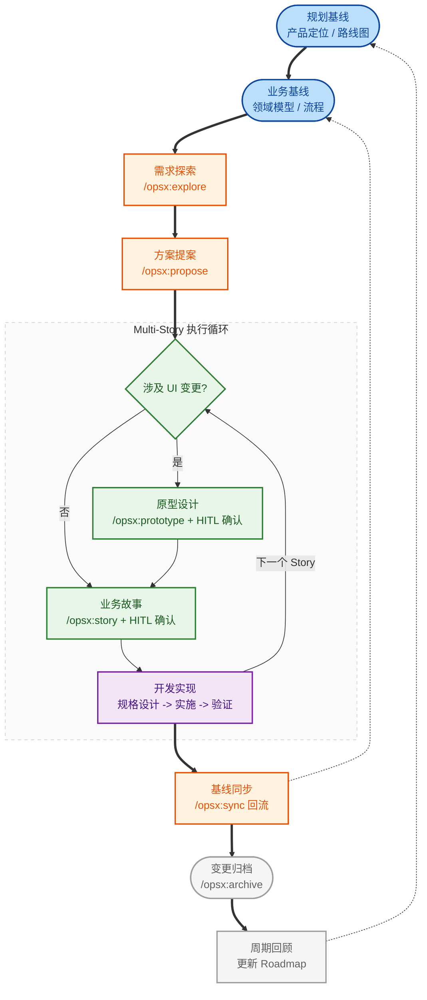

# 轻量级 SDD 脚手架提案：把产品规划、原型与需求分析接到开发闭环

> **提案目的**：给内部 AI4SE Council 一套可落地的基础方案，用较少的治理制品，把产品规划、交互原型、需求分析和规格驱动开发（SDD）接起来，支持端到端研发流程逐步达到 L3（Human in the Loop）到 L4（Human on the Loop）的成熟度。
> **开源参考**：[openspec-example](https://github.com/jkang/openspec-example.git)

---

## 📋 目录
1. [核心挑战：断链的需求工程与孤立的 SDD](#1-核心挑战断链的需求工程与孤立的-sdd)
2. [方案全貌：端到端可追溯闭环](#2-方案全貌端到端可追溯闭环)
3. [核心设计与取舍](#3-核心设计与取舍)
4. [推荐脚手架配置与目录组织](#4-推荐脚手架配置与目录组织)
5. [落地指引：如何在其他业务项目中启用](#5-落地指引如何在其他业务项目中启用)
6. [延伸思考：L3/L4 成熟度定义与落地建议](#6-延伸思考l3l4-成熟度定义与落地建议)
7. [开源资源与参考](#7-开源资源与参考)

---

## 1. 核心挑战：断链的需求工程与孤立的 SDD

现在很多团队说 SDD，实际落地主要集中在 **Coding 阶段**：
- AI 根据 spec、design、tasks 生成代码。
- Verify 保障实现质量。
- L4 的讨论也往往集中在“代码实现能否自治”。

> **痛点直击**：Coding 阶段之前的信息准备，往往还是割裂的。

- **输入不稳定**：产品规划和路线图在上游单独管理，研发拿到的往往是压缩后的结果。
- **分析无落点**：需求分析散落在会议、IM 对话和 Jira 卡片里，缺少稳定、可追溯的链路。
- **知识严重割裂**：业务文档说 A，代码实现逻辑是 B。这种“知识漂移”导致系统最终沦为黑盒。
- **高昂返工成本**：很多返工源于原型未确认、边界不清晰，导致 Spec 从一开始就偏离了真实意图。

**本提案核心：把 SDD 往前接到 Planning、Prototype 和 Analysis，让端到端流程不断链。**

---

## 2. 方案全貌：端到端可追溯闭环

### 2.1 四层架构定义

| 层级 | 核心工件 | 作用 |
| :--- | :--- | :--- |
| **Planning Baseline** | `PRODUCT_SENSE.md`, `ROADMAP.md` | 提供方向、范围和优先级边界 |
| **Business Baseline** | `domain_model.html`, `business_process.html` | 提供稳定的业务边界与流程参照 |
| **Change-Level Analysis** | `idea.md`, `proposal.md`, `story.md`, `prototypes/` | 定义单次变更的目标、交互与验收标准 |
| **Working Loop** | `specs/`, `design.md`, `tasks.md`, `verify.md` | 确保实现遵循契约，并将认知沉淀回基线 |

### 2.2 Working Loop (端到端大循环)



> **Lightweight 原则**：降低落地门槛、提升 AI 执行效能、在“混乱”与“过度治理”间寻找平衡。

---

## 3. 核心设计与取舍

### 3.1 最小治理集合：Baseline 应该放什么
- **核心必选项**：`PRODUCT_SENSE` (为什么做)、`ROADMAP` (现在做什么)、`domain_model` (业务结构)、`business_process` (L1/L2 流程)。
- **按需增强项**：`service_blueprint` (跨角色协同)、`delivery_board` (管理监督)。

### 3.2 交互原型的形式选择
- **更推荐先用单文件交互式 HTML 原型**：解决“用户怎么操作、页面怎么反馈”，不急于启动完整前端工程。
- **App-first (慎用)**：仅在交互极其复杂或需要验证特定工程约束时使用。

### 3.3 需求分析的分层与迭代管理
- **Iteration / Roadmap**：管节奏与排期。
- **Change**：管单次执行闭环（SDD 的核心单元）。
- **Story / Analysis**：管端到端旅程与业务规则，防止从 `Proposal` 直接跳步到 `Spec`。

---

## 4. 推荐脚手架配置与目录组织

### 4.1 目录组织全景图

```text
├── .agents/                 # [基础] 跨工具通用的 Agent 技能定义
├── .cursor/                 # [基础] Cursor IDE 的 SDD 规则与门禁指令
├── .trae/                   # [基础] Trae IDE 的 SDD 规则与门禁指令
├── openspec/                # [基础] SDD 引擎工作区
│   ├── config.yaml          # [业务] SDD 引擎全局配置（需修改项目名称与路径）
│   ├── specs/               # [业务] 主规格说明书（基线沉淀区）
│   └── changes/             # [基础+业务] 变更管理流
│       ├── ideas/           # 零散需求记录区
│       ├── archive/         # 已归档变更区
│       └── <change-name>/   # 活跃变更闭环区 (包含 proposal, story, specs, design, tasks, verify 等)
├── docs/                    # [业务] 项目治理与基线文档区
│   ├── SOPS/                # [基础] SDD 工作流与团队协作 SOP
│   ├── PRODUCT_SENSE.md     # [业务] 产品定位与决策准则
│   ├── ROADMAP.md           # [业务] 阶段目标与迭代排期
│   ├── FRONTEND.md          # [业务] 前端规范与验证标准 (若无前端可移除)
│   ├── ARCHITECTURE.md      # [业务] 后端架构与实现规范
│   ├── TESTING_STRATEGY.md  # [业务] 自动化测试策略与标签约束
│   ├── QUALITY_SCORE.md     # [业务] 质量基线与防漂移机制
│   └── baseline/            # [业务] 核心业务基线区
│       ├── domain_model.html      # 领域模型与边界
│       ├── business_process.html  # 业务流程流转图
│       └── service_blueprint.html # (条件启用) 服务蓝图
└── init.sh                  # [业务] 统一的工程环境启动与测试入口脚本
```

### 4.2 基础脚手架部分（直接复用）
- **护栏与指令集**: `.trae/`, `.cursor/`, `.agents/` 目录下的 `/opsx:*` 指令。
- **流程定义**: `docs/SOPS/SDD_WORKFLOW.md`。
- **产物模板**: `proposal.md`, `design.md`, `tasks.md`, `verify.md` 标准格式。

---

## 5. 落地指引：如何在其他业务项目中启用

### 5.1 第一步：引入基础引擎与清空业务示例
1. **拷贝配置**：将 `.trae/`, `.cursor/`, `.agents/`, `openspec/config.yaml` 拷至目标项目。
2. **重构 Config**：将 `config.yaml` 中的项目背景改为你真实项目的定位。
3. **初始化结构**：`mkdir -p docs/baseline openspec/changes`。

### 5.2 第二步：重写并初始化业务基线
1. **重写规划**：清空并重写 `PRODUCT_SENSE.md` 与 `ROADMAP.md`。
2. **重写规范**：按需修改 `ARCHITECTURE.md` 和 `FRONTEND.md`。
3. **初始化基线**：在 `domain_model.html` 和 `business_process.html` 中录入**当前系统真实**的边界与流程。

### 5.3 第三步：执行首个 Change 闭环
1. **启动探索**：`/opsx:explore` 分析影响范围。
2. **产出提案**：`/opsx:propose <name>` 明确变更目标。
3. **规格驱动**：`/opsx:spec-design` -> `/opsx:apply` -> `/opsx:verify`。
4. **回流基线**：`/opsx:sync` 将变更沉淀回 `docs/baseline/`。

---

## 6. 延伸思考：L3/L4 成熟度定义与落地建议

### 6.1 L3：Human in the Loop
- **特点**：人工确认是关键门禁，AI 不能跳过确认断点。
- **基础门禁**：原型确认、验收标准确认、Spec/Design 审查、Verify 结果确认。

### 6.2 L4：Human on the Loop
- **特点**：AI 在明确护栏（Baseline、门禁策略）内自治，人负责监督与异常裁决。
- **核心支撑**：稳定的 Baseline、明确的任务分类、可视化的运行看板。

### 6.3 阶段性落地建议
1. **统一最小制品**：不追求文档量，追求“需求不返工、输出稳定”。
2. **站稳 Story 层**：先落实“业务评审门禁”，解决需求跳步问题。
3. **Change 驱动基线**：让业务资产随开发自然沉淀，拒绝“一次性文档”。

---

> **核心总结**：基础版不要追求还原整套需求工程，而要先建立一条 AI 和团队都能稳定执行的 **最小知识闭环**。

---

## 7. 开源资源与参考

- **OpenSpec 示例项目**: [https://github.com/jkang/openspec-example.git](https://github.com/jkang/openspec-example.git)
- **SDD 工作流 SOP**: 参考本代码库 `docs/SOPS/SDD_WORKFLOW.md`

