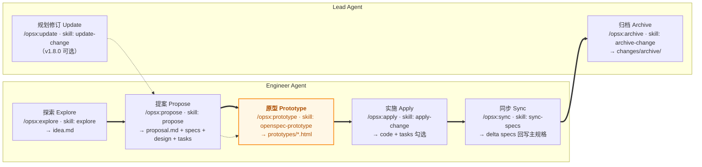
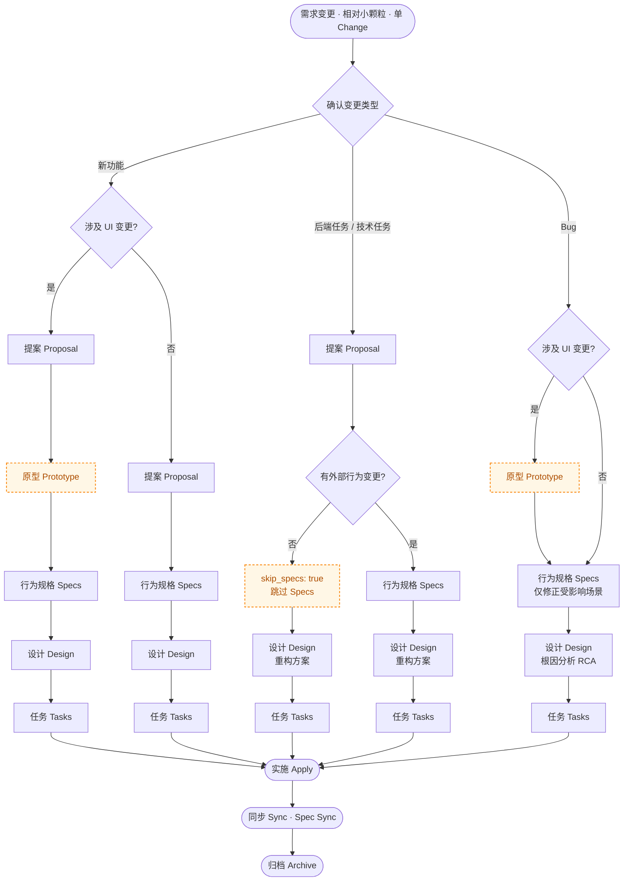

# 极简交付脚手架全景图：OpenSpec 原生默认 → 最小 SDD 扩展

> **文档定位**：补齐 `learning-sdd/visuals/workflow-blueprint.html` Layer 01「极简交付（Minimalist Delivery / Single Change Pipeline）」当时缺失的**脚手架目录组织全景图**。与 `ai4se-lightweight-sdd-proposal.md`（轻量版·历史快照）、`ai4se-sdd-proposal.md`（完整版）形成 **极简 → 轻量 → 完整** 三层递进对照。
>
> **快照锚点**：2026-08-14 ~ 2026-08-17（commit `a489c3d` → `63e4eec` → `fb263b1` → `05cb6d8`），即本仓库在引入 Story / Baseline / 需求漏斗之前的**最简 SDD 扩展形态**。
>
> **对照基准**：OpenSpec 原生默认（upstream `97f3466`，OpenSpec v1.7.0，由 `openspec init --tools claude` 生成）。
>
> **核心结论**：极简交付 = **OpenSpec 原生单 Change 管线**（explore → propose → apply → sync → archive）+ **三件最小扩展**（跨工具脚手架 / 仓库内 Schema 与模板 / 原型能力）。需求分析**只保留 `explore`（idea.md）**一步，不做 research / storymap / story / baseline。

---

## 📋 目录

1. [极简交付的定义与管线](#1-极简交付的定义与管线)
2. [提交历史证据：极简交付是哪个快照](#2-提交历史证据极简交付是哪个快照)
3. [脚手架目录组织全景图（极简交付）](#3-脚手架目录组织全景图极简交付)
4. [对照 OpenSpec 原生默认：加了什么、起什么作用](#4-对照-openspec-原生默认加了什么起什么作用)
5. [新增/修改件逐一详解](#5-新增修改件逐一详解)
6. [与轻量版 / 完整版提案的关系与升级路径](#6-与轻量版--完整版提案的关系与升级路径)
7. [如何在新项目复用极简交付](#7-如何在新项目复用极简交付)
8. [附录：证据索引](#8-附录证据索引)

---

## 1. 极简交付的定义与管线

### 1.1 定义

> **极简交付（Minimalist Delivery）= 单 Change 交付管线**：专注于**单个变更的快速闭环**，确立"意图 → 规格 → 代码"的原始线性管线。

**Balance 取舍**：最轻（零治理）、最易（单 Agent 一路到归档），但"有效"最弱——**验证门禁是唯一护栏**，无基线，变更一多就漂移；不要在此硬塞业务基线（会拖慢"想法 → 验证"的响应速度）。

### 1.2 管线（实际脚手架）

> 图例：`命令 · Skill → 产物`。**加粗**为极简交付相对 OpenSpec 原生新增的环节。



> **概念视图 vs 实际脚手架**：`workflow-blueprint.html` / `workflow-evolution.html` 的 Layer 01 把"原型设计"折叠进"提案 Propose"（`工程提案 + 原型设计`）；但在实际脚手架中，原型是一个**独立 artifact + 独立 skill/command**（`openspec-prototype`），在 `proposal` 与 `specs` 之间执行。本文以**实际脚手架**为准。

### 1.3 环节 × 命令 × Skill × 产物 对照表

| 环节 | 命令 | Skill | 产物 | 角色 | 相对原生 |
| --- | --- | --- | --- | --- | --- |
| 探索 Explore（需求分析） | `/opsx:explore` | `openspec-explore` | `changes/<name>/idea.md` | Engineer | 原生（08-17 起升格为 artifact） |
| 提案 Propose | `/opsx:propose` | `openspec-propose` | `proposal.md` + `specs/**` + `design.md` + `tasks.md` | Engineer | 原生 |
| **原型 Prototype** | `/opsx:prototype` | `openspec-prototype` | `prototypes/<capability-path>.html` | Engineer | **新增** |
| 实施 Apply | `/opsx:apply` | `openspec-apply-change` | 代码 + `tasks.md` 勾选 | Engineer | 原生 |
| 同步 Sync | `/opsx:sync` | `openspec-sync-specs` | delta → `openspec/specs/` | Engineer/Lead | 原生 |
| 归档 Archive | `/opsx:archive` | `openspec-archive-change` | `changes/archive/YYYY-MM-DD-<name>/` | Lead | 原生 |
| 规划修订 Update（可选） | `/opsx:update` | `openspec-update-change` | 修订既有规划文档（不改代码） | Engineer | 原生 |

> **需求分析范围**：极简交付的"需求分析"就是 `explore` 一步——`idea.md` 用结构化 5 步法记录业务意图、业务设计思路、需求拆分建议、架构影响、确认结论。**没有** research（调研）、storymap（拆分/覆盖对账）、story（业务面冻结）、handoff（交接）等需求漏斗环节。

### 1.4 类型分支：单 Change · 小颗粒需求

> 极简交付**每次只针对一个相对小颗粒的需求变更（单 Change）**，按变更类型走不同分支。**不含 Epic**——大块模糊需求超出"单 Change"边界，属后续扩展层（需先拆成多个 Story/Change 逐个交付）。



| 类型 | 原型 Prototype | 行为规格 Specs | 设计 Design | 关键约束 |
| --- | :---: | :---: | :---: | --- |
| **新功能**（涉及 UI） | ✅ | ✅ | ✅ | 原型是 UI 唯一事实来源，交互提取为 Scenario |
| **新功能**（不涉及 UI） | ⛔ | ✅ | ✅ | 跳过原型，直接进入规格 |
| **后端任务 / 技术任务** | ⛔ | 视外部行为变更（无则 `skip_specs: true`） | ✅ | 设计聚焦重构 / 架构方案 |
| **Bug** | 仅涉及 UI 时 | ✅（仅修正受影响场景） | ✅（根因分析 RCA） | 不写新功能长文，只改既有行为描述 |

> **边界**：Epic（大块模糊需求）**不在极简交付内**。极简交付的变更粒度是"相对小颗粒"，一次一个 Change；Epic 需要先拆分为多个 Story/Change，属流程向 Layer 02/03 扩展后才引入的形态。

---

## 2. 提交历史证据：极简交付是哪个快照

### 2.1 关键时间线（2026-08-14 → 08-19）

| 日期 | commit | 事件 | 阶段意义 |
| --- | --- | --- | --- |
| 08-14 | `97f3466` | OpenSpec 原生 v1.7.0（`openspec init --tools claude`） | **对照基准** |
| 08-14 | `a489c3d` | `init`：`.claude/` 拆为 `.agents/` + `.cursor/` + `.trae/`，技能升到 v1.9.0 | **极简交付起点** |
| 08-14 | `69d1c00` | `apply checkout feature`：新增 `AGENTS.md` | 引导入口从 `CLAUDE.md` 迁移 |
| 08-14 | `63e4eec` | `add prototype skill and command`：新增 `openspec-prototype` + `/opsx:prototype`；新增仓库内 `openspec/schemas/spec-driven.yaml`（`schemas_dir`） | **扩展核心：原型 + 仓库内 Schema** |
| 08-14 | `fb263b1` | `Update commands`：命令收敛到 `commands/opsx/` 子目录（去掉平铺 `opsx-*.md`） | 目录规范化 |
| 08-14 | `d5190cb` | `Update openspec flow`：`docs/` → `learning-sdd/`，删 `README-en.md` | 学习材料区建立 |
| 08-17 | `bac92ab` | `Update specs flow`：schema 新增 `explore` artifact + `openspec/templates/idea.md` | **需求分析落点为 idea.md** |
| 08-17 | `05cb6d8` | `update config`：`schemas_dir`、中文 context、`rules.prototype` | **极简交付终态** |
| 08-18 | `644a8ff` / `9883d60` | `introduce harness` / `add roadmap` | 开始进入轻量产品（护栏/基线） |
| 08-19 | `9ba9b6c` / `a7d8271` | `introduce multiple requirement/types` / `introduce multipe-type specflow` | **引入 4 类型分类**（Epic / Feature / Bug Fix / Tech Debt）+ 动态分支流程图 |
| 08-19 | `5f040d2` / `9fa4f30` | story skills / business baseline + sync | 进入完整版（需求漏斗 + 分层 Sync） |

### 2.2 结论

- **极简交付快照 = `05cb6d8`（2026-08-17）**：包含跨工具脚手架、仓库内 Schema/模板、原型能力、`idea.md` 需求分析，但**尚无** Story / Baseline / 需求漏斗 / harness / cucumber。
- 该快照正好对应 `workflow-blueprint.html` Layer 01 的五车道：探索 → 提案 → 实施 → 同步 → 归档。
- 之后（08-18 起）的演进即 Layer 02「轻量产品」与 Layer 03「业务产品」。

---

## 3. 脚手架目录组织全景图（极简交付）

```text
OpenSpec-practice/                        # 极简交付快照（2026-08-17 · commit 05cb6d8）
│
├── .agents/                              # [新增] 通用 Agent 适配层（codex / opencode）
│   ├── commands/opsx/                    #   /opsx:* 命令定义（7 个）
│   │   ├── explore.md                    #     探索
│   │   ├── propose.md                    #     提案
│   │   ├── prototype.md                  #     原型           ← 新增
│   │   ├── apply.md                      #     实施
│   │   ├── sync.md                       #     同步
│   │   ├── archive.md                    #     归档
│   │   └── update.md                     #     规划修订
│   └── skills/                           #   SDD 技能（7 个 + 目标标记）
│       ├── .openspec-target              #     目标工具标记（内容：codex）
│       ├── openspec-explore/SKILL.md
│       ├── openspec-propose/SKILL.md
│       ├── openspec-prototype/SKILL.md   #     原型技能      ← 新增
│       ├── openspec-apply-change/SKILL.md
│       ├── openspec-sync-specs/SKILL.md
│       ├── openspec-archive-change/SKILL.md
│       └── openspec-update-change/SKILL.md
│
├── .cursor/                              # [新增] Cursor IDE 适配副本（结构同 .agents）
│   ├── commands/opsx/                    #   /opsx:* 命令
│   └── skills/                           #   SDD 技能
│
├── .trae/                                # [新增] Trae IDE 适配副本（结构同 .agents）
│   ├── commands/opsx/                    #   /opsx:* 命令
│   └── skills/                           #   SDD 技能
│
├── openspec/                             # [原生] SDD 引擎工作区
│   ├── config.yaml                       # [修改] schema 声明 + schemas_dir + 中文 context + rules.prototype
│   ├── schemas/                          # [新增] 仓库内 Schema（工作流唯一事实来源）
│   │   └── spec-driven.yaml              #   explore→proposal→prototype→specs→design→tasks
│   ├── templates/                        # [新增] 仓库内模板
│   │   └── idea.md                       #     explore 产物模板
│   ├── specs/                            # [原生] 主规格沉淀区（capability/spec.md）
│   └── changes/                          # [原生] 活跃变更区
│       └── archive/                      #   已归档变更（YYYY-MM-DD-<name>/）
│
├── AGENTS.md                             # [新增] Agent 引导入口（替代原生 CLAUDE.md）
├── ecommerce/                            # [业务] 示例应用（Node / Python / Vue）
├── examples/                             # [原生残留] 早期示例目录（仅 .vite 缓存）
├── learning-sdd/                         # [新增] 学习材料与提案文档（由 docs/ 迁移）
├── README.md                             # [修改] 改写为 SDD 实战案例说明
├── CHANGELOG.md
├── LICENSE
└── .gitignore
│
└── (已移除) .claude/ · CLAUDE.md · docs/ · docs-en/ · README-en.md
```

> **三目录同步**：`.agents/` / `.cursor/` / `.trae/` 内容一致（`.agents` 为通用基准，`.cursor`/`.trae` 为格式适配副本），任一 skill/command 改动必须三处同步——这是后续 `AGENTS.md` 硬约束的雏形。

---

## 4. 对照 OpenSpec 原生默认：加了什么、起什么作用

### 4.1 顶层目录对照

| 目录/文件 | OpenSpec 原生默认（`97f3466`） | 极简交付（`05cb6d8`） | 变化 | 作用 |
| --- | --- | --- | --- | --- |
| `.claude/` | ✅ 唯一 AI 工具目录（commands + skills） | ❌ 移除 | **替换** | 原生只服务 Claude Code |
| `.agents/` | ❌ | ✅ commands/opsx + skills | **新增** | 通用 Agent 适配（codex/opencode），三目录同步基准 |
| `.cursor/` | ❌ | ✅ commands/opsx + skills | **新增** | Cursor IDE 适配 |
| `.trae/` | ❌ | ✅ commands/opsx + skills | **新增** | Trae IDE 适配 |
| `AGENTS.md` | ❌（仅有 `CLAUDE.md`） | ✅ | **新增** | 跨工具统一的 Agent 引导入口 |
| `CLAUDE.md` | ✅ | ❌ 移除 | **替换** | 被 AGENTS.md 取代 |
| `openspec/schemas/` | ❌（用 CLI 内置 schema） | ✅ `spec-driven.yaml` | **新增** | 工作流可版本控制、可定制 |
| `openspec/templates/` | ❌ | ✅ `idea.md` | **新增** | 仓库内产物模板（覆盖 CLI 内置） |
| `openspec/config.yaml` | ✅ 基础声明 | ✅ 增强 | **修改** | `schemas_dir` + 中文 context + prototype 规则 |
| `docs/` `docs-en/` | ✅ | ❌（迁至 `learning-sdd/`） | **重组** | 学习材料独立分区 |
| `learning-sdd/` | ❌ | ✅ | **新增** | SDD 学习材料与提案文档 |
| `examples/` | ✅ | ✅（残留） + `ecommerce/` | **新增别名** | 业务示例目录重命名过渡 |
| `ecommerce/` | ❌ | ✅ | **新增** | 示例应用主目录 |

### 4.2 Skills 对照

| Skill | 原生 | 极简交付 | 变化 | 作用 |
| --- | :---: | :---: | --- | --- |
| `openspec-explore` | ✅ | ✅（v1.9.0） | 升级 | 探索/需求分析：产出 `idea.md`（结构化 5 步法） |
| `openspec-propose` | ✅ | ✅ | 升级 | 提案：按 schema 生成 proposal/specs/design/tasks |
| `openspec-prototype` | ❌ | ✅ | **新增** | 生成 Modern Flat 规范的交互式 HTML 原型（Vue 3 + Tailwind CDN） |
| `openspec-apply-change` | ✅ | ✅ | 升级 | 按 tasks 实施代码并勾选 |
| `openspec-sync-specs` | ✅ | ✅ | 升级 | delta specs 回写主规格 |
| `openspec-archive-change` | ✅ | ✅ | 升级 | 归档已完成变更 |
| `openspec-update-change` | ✅ | ✅ | 升级 | 修订既有规划文档并保持一致性（不改代码） |

> 共 **6 个原生**（无 prototype）+ **1 个新增** = 7 个技能 × 3 个工具目录。

### 4.3 Commands 对照

| Command | 原生 | 极简交付 | 变化 | 作用 |
| --- | :---: | :---: | --- | --- |
| `/opsx:explore` | ✅ | ✅ | 升级 | 进入探索模式（只思考/只记录，不实现） |
| `/opsx:propose` | ✅ | ✅ | 升级 | 创建 change 并生成全部规划 artifacts |
| `/opsx:prototype` | ❌ | ✅ | **新增** | 生成/更新交互式原型，调用 `openspec-prototype` |
| `/opsx:apply` | ✅ | ✅ | 升级 | 实施 tasks |
| `/opsx:sync` | ✅ | ✅ | 升级 | 同步 delta specs |
| `/opsx:archive` | ✅ | ✅ | 升级 | 归档变更 |
| `/opsx:update` | ✅ | ✅ | 升级 | 修订规划文档 |

> 共 **6 个原生** + **1 个新增** = 7 个命令 × 3 个工具目录。`fb263b1` 后统一收敛到 `commands/opsx/` 子目录。

### 4.4 `openspec/` 工作区对照

| 项 | 原生 | 极简交付 | 变化 |
| --- | --- | --- | --- |
| `config.yaml: schema` | `spec-driven` | `spec-driven` | 不变 |
| `config.yaml: schemas_dir` | ❌ | `schemas` | **新增**（启用仓库内 schema） |
| `config.yaml: context` | 英文、单项目 | 中文、多技术栈 | 修改 |
| `config.yaml: rules` | proposal/specs/design/tasks | + `prototype` | **新增规则** |
| `schemas/spec-driven.yaml` | CLI 内置，不可见 | 仓库内文件 | **新增** |
| `templates/idea.md` | ❌ | ✅ | **新增** |
| `specs/` `changes/` | ✅ | ✅ | 不变 |

### 4.5 变更清单总表

| 类别 | 变更项 | 数量 | 一句话作用 |
| --- | --- | --- | --- |
| **目录** | `.agents/` `.cursor/` `.trae/`（替换 `.claude/`） | 3 | 一次编写，多 IDE 复用 |
| **目录** | `learning-sdd/`（替换 `docs/` `docs-en/`） | 1 | 学习材料独立分区 |
| **入口** | `AGENTS.md`（替换 `CLAUDE.md`） | 1 | 跨工具统一引导 |
| **Skill** | `openspec-prototype` | 1 | 交互式 HTML 原型验证 |
| **Command** | `/opsx:prototype` | 1 | 原型生成入口 |
| **Schema** | `openspec/schemas/spec-driven.yaml` | 1 | 工作流可版本控制/可定制 |
| **模板** | `openspec/templates/idea.md` | 1 | 需求分析落点模板 |
| **配置** | `config.yaml`（schemas_dir + prototype 规则 + 中文 context） | 1 | 引擎按项目定制运行 |
| **升级** | 6 skills + 6 commands 升到 v1.9.0 | 12 | 对齐新 CLI 能力（store、fluid、schema-driven） |

---

## 5. 新增/修改件逐一详解

### 5.1 跨工具脚手架 `.agents/` `.cursor/` `.trae/`（新增）

- **做了什么**：把原生单一 `.claude/` 产物拆分为三个等价目录；`.agents/` 作为通用基准，`.cursor/`、`.trae/` 为格式适配副本。`.agents/skills/.openspec-target` 标记目标工具（`codex`）。
- **为什么**：原生 `openspec init --tools claude` 只服务 Claude Code；项目需要在 **opencode / Cursor / Trae** 间保持同一套 SDD 工作流，避免"工具各写各的"导致协作漂移。
- **作用**：同一份 SDD 指令集跨工具可用；后续演化为 `AGENTS.md` 中的**三目录同步硬约束**。

### 5.2 `AGENTS.md`（新增，替代 `CLAUDE.md`）

- **做了什么**：把仓库引导（项目概览、架构、命令、SDD 工作流）从 Claude 专属文件名改为工具中立的 `AGENTS.md`。
- **作用**：任何 Agent 工具读取同一入口；是"以代码库为唯一事实来源"的落地起点。

### 5.3 `openspec/schemas/spec-driven.yaml`（新增）

- **做了什么**：把原本藏在 CLI 内置的 `spec-driven` schema 显式落盘到仓库，并在 `config.yaml` 用 `schemas_dir: schemas` 指向它。schema 定义 artifacts 及依赖：
  - `explore` → `idea.md`（`05cb6d8` 终态）
  - `proposal` → `proposal.md`（requires: explore）
  - `prototype` → `prototypes/**/*.html`（requires: proposal）
  - `specs` → `specs/**/*.md`（requires: proposal, prototype）
  - `design` → `design.md`（requires: proposal）
  - `tasks` → `tasks.md`（requires: specs, design）
  - `apply` → `tracks: tasks.md`
- **为什么**：CLI 内置 schema 不可见、不可改；把工作流定义落盘后，团队可**版本控制、审查、按项目定制**，并与 CLI 解耦。
- **作用**：工作流从"工具内置"变成"项目资产"——这是本仓库 SDD 扩展的**最底层事实来源**。

### 5.4 `openspec/templates/idea.md`（新增）

- **做了什么**：为 `explore` artifact 提供结构化模板（业务意图 / 业务设计思路 / 需求拆分建议 / 架构影响 / 确认结论）。
- **作用**：让"简单需求分析"有稳定落点与统一格式，避免探索结论散落在对话里。

### 5.5 `openspec/config.yaml`（修改）

- **做了什么**：
  - 新增 `schemas_dir: schemas`（启用仓库内 schema）
  - `context` 从英文单项目改为中文、覆盖 Node/Python/Vue 多技术栈
  - `rules` 新增 `prototype` 段（Modern Flat：1px 边框、无阴影、无渐变、Shadcn 风格、单屏紧凑）
  - 扩写 `specs`（Gherkin + P0/P1/P2 + 嵌入原型代码）、`design`（UI 层级 + E2E 全链路）、`tasks`（跨端 E2E 验证）规则
- **作用**：让引擎按项目真实约束运行；把"原型是 specs 的唯一事实来源"写进规则。

### 5.6 `openspec-prototype` skill + `/opsx:prototype` command（新增）

- **做了什么**：新增原型技能与命令，在 `proposal` 与 `specs` 之间插入**交互式 HTML 原型**环节；产物 `prototypes/<capability-path>.html`。
- **设计约束**：单文件 HTML、Vue 3（CDN）+ Tailwind（CDN）、Modern Flat（1px 边框/无阴影/无渐变）、Shadcn 式组件、状态驱动交互。
- **作用**：在写 specs 之前用最低成本达成**视觉/交互共识**；原型确认后可将其交互逻辑提取为 Scenario 并 `<details>` 嵌入 `spec.md`。这是极简交付相对原生的**核心增量**。

### 5.7 6 skills + 6 commands 升级到 v1.9.0（修改）

- **做了什么**：原生 `.claude/` 为 v1.7.0 产物；`a489c3d` 起统一升级为 v1.9.0 产物（`generatedBy: 1.9.0`），补齐 store 选择、fluid workflow、schema-driven artifacts、capability-path 等能力。
- **作用**：对齐新版 CLI；`explore` 增强为"可无缝 scaffold 新 change"，`propose` 增加 planning boundary（只规划不实现），`sync` 支持能力退役判定等。

### 5.8 `learning-sdd/`（新增，由 `docs/` 迁移）

- **做了什么**：把 `docs/` + `docs-en/` 的 OpenSpec 手册/分析迁入 `learning-sdd/`，删除 `README-en.md`。
- **作用**：学习材料与工程代码分区；为后续提案文档（`ai4se-*-proposal.md`）、讲解 PPT、workflow 可视化提供统一落点。

---

## 6. 与轻量版 / 完整版提案的关系与升级路径

```
极简交付（Layer 01 · 本文档）
   │  + 规划 / 业务基线护栏 → 多 Story 循环
   ▼
轻量产品（Layer 02 · ai4se-lightweight-sdd-proposal.md）
   │  + 需求侧/交付侧解耦 → 分层同步 → 双环治理
   ▼
业务产品（Layer 03 · ai4se-sdd-proposal.md）
```

| 维度 | 极简交付（本文档） | 轻量产品 | 业务产品 |
| --- | --- | --- | --- |
| 工作单元 | 单 Change | Multi-Story | Epic / Story（需求漏斗） |
| 需求分析 | 仅 `explore`（idea.md） | + 规划/业务基线 | research→explore→prototype→storymap→story→handoff |
| 目录 | `.agents/.cursor/.trae` + `openspec/` | + `docs/baseline/` + `ROADMAP` | + `openspec-requirements/` |
| Sync | Spec Sync（change 级） | Spec Sync + 基线护栏 | 分层 Sync（change 级 Spec + Epic 级 Baseline） |
| 治理强度 | 最轻（验证门禁兜底） | 中（最小治理集合） | 最重（完整但不臃肿） |

### 6.1 类型分支的边界：极简交付**不含 Epic**

极简交付每次只处理**一个相对小颗粒的需求变更（单 Change）**，其类型集为 **新功能（涉及 UI / 不涉及 UI）、后端任务/技术任务、Bug** 三类（分支图见 [§1.4](#14-类型分支单-change--小颗粒需求)），**不含 Epic**——大块模糊需求超出"单 Change"边界，需先拆分为多个 Story/Change，属后续扩展层。

**与"有 Epic 的最新版本"的区别**

仓库中第一次把任务类型**显式写进 SOP / Schema** 是 08-19 `9ba9b6c`（"introduce multiple requirement/types"）；当时流程已开始向多 Story 扩展，因此把 **Epic** 作为第 4 类一并纳入（Epic / Feature / Bug Fix / Tech Debt）。极简交付层只保留"小颗粒单 Change"的 3 类；**Epic 与正式的多类型动态分支属于 Layer 02/03 的扩展**。

**决策点：Explore 定类型，Propose 消费类型**

- 类型在 **Explore 阶段**确定（写入 `idea.md` 的"任务类型与后续策略"）。
- `/opsx:propose` 只**读取** `idea.md` 的类型并据此分支（是否跑 Prototype、是否 `skip_specs`）。
- 所以不是"在 Propose 一开始分类型"——真正的一开始是 **Explore**。

**类型对照**

| 你提到的类型 | 极简交付类型 | UI 子分支 / 约束 |
| --- | --- | --- |
| 新功能 | **新功能** | 涉及 UI 变更 → 走 Prototype；不涉及 → 跳过 Prototype |
| 后端任务 / 技术任务 | **后端任务 / 技术任务** | 跳过 Prototype；无外部行为变更 → `skip_specs: true` |
| Bug | **Bug** | 涉及 UI 才走 Prototype；Specs 仅修正受影响场景；Design 做根因分析（RCA） |
| （不适用） | ~~Epic~~ | 超出"单 Change"边界，属后续扩展层 |

> **演进时间线**：`05cb6d8`（08-17，极简交付，单 Change 小颗粒）→ `9ba9b6c`（08-19，首次显式写入类型，随流程扩展同时纳入 Epic）→ `a7d8271`（08-19，SOP 补动态分支流程图）→ `d96d9ce`（08-19，specflow 中 Feature 改称 Story）。

> **演进触发信号**（何时从极简交付升级）：
> 1. 出现"多 Story 并行、方向易漂移" → 引入 Layer 02 的**规划 + 业务基线护栏**。
> 2. 出现"需求分析无落点、多 Epic 并行、基线频繁漂移" → 引入 Layer 03 的**需求侧工作区 + 分层 Sync**。

---

## 7. 如何在新项目复用极简交付

### 7.1 最小落地清单

1. **引入引擎与跨工具脚手架**：
   ```bash
   npm install -g @fission-ai/openspec@latest
   openspec init --tools trae     # 或 codex / cursor
   ```
   将生成的命令/技能复制为 `.agents/`、`.cursor/`、`.trae/` 三份并保持同步。
2. **落盘仓库内 Schema 与模板**：新增 `openspec/schemas/spec-driven.yaml`，在 `openspec/config.yaml` 声明 `schemas_dir: schemas`；按需新增 `openspec/templates/idea.md`。
3. **配置项目上下文**：改写 `config.yaml` 的 `context` 与 `rules`（含 `prototype` 规则，若有前端）。
4. **新增原型能力**：引入 `openspec-prototype` skill + `/opsx:prototype` command。
5. **建立统一入口**：编写 `AGENTS.md`（项目概览 / 架构 / 命令 / SDD 工作流）。
6. **执行首个 Change 闭环**：`/opsx:explore` → `/opsx:propose` → `/opsx:prototype`（可选）→ `/opsx:apply` → `/opsx:sync` → `/opsx:archive`。

### 7.2 极简交付的"不要做"

- ❌ 不要引入业务基线（`domain_model` / `business_process` / `service_blueprint`）——会拖慢"想法 → 验证"的响应速度。
- ❌ 不要引入需求漏斗（research / storymap / story / handoff）——单 Change 用不上。
- ❌ 不要引入 Epic 级 Baseline Sync——没有 Epic 概念。
- ✅ 唯一护栏是**验证门禁**（apply 后跑测试 / verify）。

---

## 8. 附录：证据索引

| 内容 | 位置 |
| --- | --- |
| OpenSpec 原生基准（v1.7.0） | commit `97f3466`（`.claude/` + `openspec/`） |
| 极简交付起点 | commit `a489c3d`（`init`） |
| 原型能力引入 | commit `63e4eec`（`add prototype skill and command`） |
| 命令目录收敛 | commit `fb263b1`（`Update commands`） |
| 需求分析落点 idea.md | commit `bac92ab`（`Update specs flow`） |
| **极简交付终态** | commit `05cb6d8`（`update config`，2026-08-17） |
| 任务类型分类引入（极简交付**之后**） | commit `9ba9b6c`（`introduce multiple requirement/types`，08-19）+ `a7d8271`（动态分支流程图） |
| 极简交付概念图 | `learning-sdd/visuals/workflow-blueprint.html`（Layer 01）、`workflow-evolution.html`（Slide 1） |
| 演讲分层说明 | `learning-sdd/TALK_PRD_TO_SPECS.md`（§01.5 / §01.6） |
| 轻量版提案 | `learning-sdd/ai4se-lightweight-sdd-proposal.md` |
| 完整版提案 | `learning-sdd/ai4se-sdd-proposal.md` |
| 当前流程权威 | `docs/SOPS/SDD_WORKFLOW.md` |

---

> **核心总结**：极简交付只做三件最小扩展——**跨工具脚手架**（多 IDE 复用）、**仓库内 Schema/模板**（工作流可版本控制）、**原型能力**（交互共识前置）；需求分析只保留 `explore` 一步。它用最低治理成本换取最快响应速度，是"极简 → 轻量 → 完整"三层升级弧线的起点。
