# SDD 完整版提案：复杂业务端到端流程与脚手架

> **提案目的**：给内部 AI4SE Council 一套**面向复杂业务的完整端到端流程与脚手架**——覆盖 产品规划 → 需求调研 → 探索 → 原型 → 需求拆分 → Story 业务面冻结 → 交接 → 开发实施 → 分层同步 → 归档，全链路可追溯，支持研发流程达到 L3（Human in the Loop）到 L4（Human on the Loop）的成熟度。
> **版本定位**（与轻量版区分）：
> - **轻量版** `ai4se-lightweight-sdd-proposal.md`：**历史快照**——单条知识闭环起步最小集，保留早期流程（含已移除的 `/opsx:explore`、`/opsx:story`）作演进对照；**当前流程以本文档与 `docs/SOPS/SDD_WORKFLOW.md` 为准**。
> - **完整版（本文档）**：**复杂业务全流程**——引入需求侧/交付侧两级解耦（`openspec-requirements/` + `openspec/`），补齐需求工程链路（调研/探索/原型/拆分/Story + 可选分析工具箱），加入分层 Sync（change 级 Spec + Epic 级 Baseline），支撑多 Story 多 Epic 的规模化协作。
> **演进路径**：团队可从轻量版起步，业务复杂度提升后按本文档迁移到完整版（增量启用需求侧工作区与分层 Sync）。
> **对齐基线**：本文档已对齐当前代码库（OpenSpec v2.0，`docs/SOPS/SDD_WORKFLOW.md`、`openspec-requirements/README.md`、`openspec/schemas/spec-driven.yaml`、`openspec-requirements/schemas/req-sdd.yaml` v5）。
> **开源参考**：[openspec-example](https://github.com/jkang/openspec-example.git)

---

## 📋 目录
1. [核心挑战：断链的需求工程与孤立的 SDD](#1-核心挑战断链的需求工程与孤立的-sdd)
2. [方案全貌：端到端可追溯闭环](#2-方案全貌端到端可追溯闭环)
3. [核心设计与取舍](#3-核心设计与取舍)
4. [推荐脚手架配置与目录组织](#4-推荐脚手架配置与目录组织)
5. [落地指引：如何在其他业务项目中启用](#5-落地指引如何在其他业务项目中启用)
6. [延伸思考：L3/L4 成熟度定义与落地建议](#6-延伸思考l3l4-成熟度定义与落地建议)
7. [开源资源与参考](#7-开源资源与参考)

---

## 1. 核心挑战：断链的需求工程与孤立的 SDD

当业务复杂度提升（多 Epic、多 Story、跨角色协同）时，仅靠 Coding 阶段的 SDD 闭环会暴露严重的上游断链：

- **输入不稳定**：产品规划和路线图在上游单独管理，研发拿到的往往是压缩后的结果。
- **分析无落点**：需求分析散落在会议、IM 对话和 Jira 卡片里，缺少稳定、可追溯的链路。
- **知识严重割裂**：业务文档说 A，代码实现逻辑是 B。这种"知识漂移"导致系统最终沦为黑盒。
- **高昂返工成本**：很多返工源于原型未确认、边界不清晰，导致 Spec 从一开始就偏离了真实意图。
- **规模化失控**：多个 Epic/Story 并行时，缺乏统一的需求漏斗、覆盖对账与基线同步机制，易出现"承诺但不交付"、基线中间态污染。
- **工具与角色碎片化**：同一套流程在 Trae / Cursor / 通用 Agent 下各自为政，角色定义与命令不同步，导致协作漂移。

**本提案核心：面向复杂业务，把 SDD 往前接到 Planning、Research、Prototype 和 Analysis，用需求侧/交付侧两级解耦 + 分层 Sync 让端到端流程不断链；并用"三目录同步 + 角色权威源"把工具与角色的漂移钉死。**

---

## 2. 方案全貌：端到端可追溯闭环

### 2.1 四层架构定义

| 层级 | 核心工件 | 作用 |
| :--- | :--- | :--- |
| **Planning Baseline** | `docs/PRODUCT.md`, `docs/ROADMAP.md` | 提供方向、范围和优先级边界；**ROADMAP 按阶段组织，每阶段条目即 Epic（一句话描述），一阶段可含多 Epic** |
| **Business Baseline** | `docs/baseline/domain_model.html`, `business_process.html`, `service_blueprint.html`（+ `design-system/`） | 提供稳定的业务边界、流程参照与 UI 事实来源 |
| **Requirements 需求侧** | `openspec-requirements/epics/<epic-key>/`：`STATUS.md`、`research.md`、`idea.md`、`analysis/`、`prototypes/`、`storymap.md`、`stories/<story-key>/story.md` | 需求调研 → 探索 → （可选分析）→ 原型 → 拆分 → Story（业务面冻结交付物），以 Epic 为工作单元，PM 主导，**仅大块 Epic** |
| **Working Loop 交付侧** | `openspec/changes/<name>/`：`proposal.md`, `specs/`, `design.md`, `tasks.md`, `verify.md` | 确保实现遵循契约，并将认知沉淀回基线，Engineer 主导 |

> **横切资产**：`openspec-requirements/tools/`（需求分析工具箱，8 个 AI4PM 工具，可选增强）；`.opencode/` / `.agents/` / `.cursor/` / `.trae/`（角色定义 + 三目录同步的 skills/commands）。

### 2.2 Working Loop（端到端大循环）

> 图例：节点标注 `command · skill · 产物`。需求侧命令空间 `/req:`，交付侧 `/opsx:`，规划层 `/opsx:planning:`。`+HITL` = 需人工确认（Human in the Loop 门禁），粗粒度阶段尤其需要。

```mermaid
flowchart TD
    %% ===== 基线层 =====
    A([规划基线<br/>/opsx:planning:product-vision<br/>/opsx:planning:product-planning<br/>PRODUCT.md / ROADMAP.md])
    B([业务基线<br/>/opsx:baseline/sync<br/>domain_model / business_process / service_blueprint])

    %% ===== 适用范围路由 =====
    R{适用范围路由<br/>任务类型?}

    %% ===== 需求侧 =====
    subgraph ReqSide [需求侧 · 仅大块 Epic · PM 主导]
        direction TB
        P1[需求调研 +HITL<br/>/req:research · skill: research<br/>→ research.md（针对单个 Epic 收集需求）]
        P2[探索 +HITL<br/>/req:explore · skill: explore<br/>→ idea.md（业务设计：<br/>To-Be Process / To-Be Journey /<br/>产品设计思路）<br/>+ 识别候选 Capabilities<br/>（对齐 domain_model BC→Capability）]
        P4{涉及 UI?}
        P5[原型设计（Epic 整体）+HITL<br/>/req:prototype · skill: prototype<br/>→ prototypes/*.html<br/>（复杂业务 → prototypes/working/）]
        P3[需求拆分 +HITL<br/>/req:storymap · skill: storymap<br/>→ storymap.md（覆盖对账·端到端粒度）]
        P6[Story 交付物 +HITL<br/>/req:story · skill: story<br/>→ stories/&lt;story-key&gt;/story.md（业务面）]
        T[需求分析工具箱 tools/ · 可选<br/>OSM / Process / Journey /<br/>Storymap / Narrative<br/>→ analysis/&lt;type&gt;/]
    end

    %% ===== 交接边界 =====
    subgraph Handoff [交接边界]
        H1[handoff<br/>/req:handoff · skill: handoff<br/>→ 合成开发侧 proposal.md]
    end

    %% ===== 交付侧 =====
    subgraph DevSide [交付侧 · Engineer 主导]
        direction TB
        D1[提案<br/>/opsx:propose · skill: propose<br/>→ proposal.md（handoff 合成 或 直走）]
        D2[行为规格<br/>/opsx:spec-design · skill: spec-design<br/>→ specs/*.md（Story-specs·按 capability·h3/h4）]
        D3[设计<br/>/opsx:spec-design · skill: spec-design<br/>→ design.md + tasks.md]
        D4[实施与验证 +HITL<br/>/opsx:apply · skill: apply-change<br/>→ 代码 + verify.md<br/>/opsx:verify · skill: verify]
    end

    %% ===== 收尾层 =====
    K1[Spec Sync · change 级<br/>/opsx:sync · skill: sync-specs<br/>→ delta specs 合并入 openspec/specs]
    L([变更归档<br/>/opsx:archive · skill: archive-change<br/>→ 归档 + epic 队列更新])
    K2[Baseline Sync +HITL · Epic 级<br/>/opsx:baseline/sync · skill: baseline/*<br/>→ 统一回流 docs/baseline + ROADMAP]
    M[周期回顾<br/>/opsx:planning:product-planning · skill: product-planning<br/>→ 更新 ROADMAP]

    %% ===== 流程连接 =====
    A ==> B
    B ==> R

    R -- 大块 Epic --> P1
    R -- Bug Fix / Tech Debt / 简单功能 --> D1

    P1 ==> P2
    P2 ==> P4
    P2 -. 可选增强 .-> T
    P3 -. 可选增强 .-> T
    P6 -. 可选增强 .-> T
    P4 -- 是 --> P5
    P4 -- 否 --> P3
    P5 --> P3
    P3 ==> P6
    P6 ==> H1
    H1 ==> D1

    D1 ==> D2
    D2 ==> D3
    D3 ==> D4
    D4 ==> K1
    K1 ==> L

    L -- 该 Epic 还有下一个 Story --> P6
    L -- 该 Epic 全部 Story 已完成 --> K2
    K2 -.-> B
    K2 ==> M
    M -.-> A

    %% ===== 样式定义 =====
    classDef baseline fill:#bbdefb,stroke:#0d47a1,stroke-width:2px,color:#0d47a1
    classDef logic fill:#fff3e0,stroke:#e65100,stroke-width:2px,color:#e65100
    classDef decision fill:#e8f5e9,stroke:#2e7d32,stroke-width:2px,color:#1b5e20
    classDef impl fill:#f3e5f5,stroke:#7b1fa2,stroke-width:2px,color:#4a148c
    classDef archive fill:#f5f5f5,stroke:#9e9e9e,stroke-width:2px,color:#616161
    classDef optional fill:#fffde7,stroke:#f9a825,stroke-width:1.5px,stroke-dasharray: 4 3,color:#f57f17

    class A,B baseline
    class R,P4 decision
    class P1,P2,P3,P5,P6,H1,K1,K2 logic
    class D1 logic
    class D2,D3,D4 impl
    class L,M archive
    class T optional

    style ReqSide fill:#e8f5e9,stroke:#2e7d32,stroke-dasharray: 5 5
    style Handoff fill:#fff8e1,stroke:#f57f17,stroke-dasharray: 5 5
    style DevSide fill:#f3e5f5,stroke:#7b1fa2,stroke-dasharray: 5 5
```



### 2.3 节点 × 命令 × Skill × 产物 对照表

| 节点 | 环节 | 命令 | Skill | 产物 | 主导 | HITL |
| --- | --- | --- | --- | --- | --- | --- |
| A | 规划基线（起点即含 roadmap·每阶段多 Epic） | `/opsx:planning:product-vision` / `product-planning` | `product-vision` / `product-planning` | `docs/PRODUCT.md` / `docs/ROADMAP.md` | PM | — |
| B | 业务基线 | `/opsx:baseline/sync` | `blueprint` / `domain-model` / `process-flow` / `render` | baseline 三件套 html（+ `design-system/`） | PM/Lead | — |
| R | 适用范围路由 | 决策点 | — | 分流：Epic→需求侧；其余→交付侧 | Lead | — |
| P1 | 需求调研 | `/req:research` | `research` | `epics/<key>/research.md`（单 Epic） | PM | ✅ |
| P2 | 探索 | `/req:explore` | `explore` | `epics/<key>/idea.md`（To-Be Process/Journey + 候选 Capabilities） | PM | ✅ |
| P4 | UI 决策 | 决策点 | — | — | PM | — |
| P5 | 原型设计（Epic 整体） | `/req:prototype` | `prototype` | `epics/<key>/prototypes/*.html`（复杂业务 → `prototypes/working/`） | PM | ✅ |
| P3 | 需求拆分 | `/req:storymap` | `storymap` | `epics/<key>/storymap.md`（覆盖对账） | PM | ✅ |
| P6 | Story 交付 | `/req:story` | `story` | `epics/<key>/stories/<story-key>/story.md`（业务面） | PM | ✅ |
| T | 可选分析增强（optional） | 阶段 skill 编排 `tools/` | `tools/*`（8 个 AI4PM 工具） | `epics/<key>/analysis/{osm,process,journey,storymap,narrative}/` | PM | — |
| H1 | 交接 | `/req:handoff` | `handoff` | 合成开发侧 `proposal.md` + 登记 `epic-<key>.story-list.json` | Lead/PM | — |
| D1 | 提案 | `/opsx:propose` | `propose` | `proposal.md` | Engineer | — |
| D2 | 行为规格 | `/opsx:spec-design` | `spec-design` | `specs/*.md`（Story-specs） | Engineer | — |
| D3 | 设计 | `/opsx:spec-design` | `spec-design` | `design.md` + `tasks.md` | Engineer | — |
| D4 | 实施与验证 | `/opsx:apply` → `/opsx:verify` | `apply-change` / `verify` | 代码 + `verify.md` | Engineer | ✅ |
| K1 | Spec Sync（change 级） | `/opsx:sync` | `sync-specs` | delta→`openspec/specs` | Lead | — |
| L | 归档 | `/opsx:archive` | `archive-change` | 归档 + epic 队列更新 | Lead | — |
| K2 | Baseline Sync（Epic 级） | `/opsx:baseline/sync` | `blueprint` / `domain-model` / `process-flow` / `render` | 统一回流 `docs/baseline/*.html` | Lead | ✅ |
| M | 周期回顾 | `/opsx:planning:product-planning` | `product-planning` | 更新 `docs/ROADMAP.md` | PM | — |

---

## 3. 核心设计与取舍

### 3.1 需求侧 / 交付侧两级解耦
- **需求侧**（`openspec-requirements/`，PM 主导，**仅大块 Epic**）：规划在起点已有（ROADMAP 每阶段多 Epic），需求侧直接针对单个 Epic 做**调研 → 探索 → 原型 → 拆分 → Story**，并在 Epic 目录内用 `STATUS.md` 维护生命周期状态。
- **交付侧**（`openspec/changes/`，Engineer 主导）：从 `proposal` 起步（handoff 合成 或直走），按 capability 拆分行为规格 specs（Story-specs），不再重复需求侧阶段。

### 3.2 适用范围路由
- **大块 Epic** → 需求侧漏斗 → `/req:handoff` → 交付侧。
- **Bug Fix / Tech Debt / 简单功能修改** → 直走交付侧（`/opsx:propose` 起），不走需求漏斗。

### 3.3 需求漏斗各环节（含可选分析工具箱）

| 环节 | skill | 产物 | 要点 |
| --- | --- | --- | --- |
| 需求调研 | `research` | `research.md` | 针对单个 Epic：背景/干系人/**访谈原始记录（内嵌）**/约束/疑问/结论；**先调研→识别 Epic→创建 `epics/<epic-key>/`** |
| 探索 | `explore` | `idea.md` | 调研 → 产品设计思路；**含 To-Be Process / To-Be Journey 业务设计**；**识别候选 Capabilities**（对齐 domain_model） |
| 原型（Epic 整体） | `prototype` | `prototypes/*.html` | 拆分**前**对 Epic 整体做一次；复杂业务可走 `prototype-generator` → `prototypes/working/`；HITL 确认 |
| 需求拆分 | `storymap` | `storymap.md` | **覆盖对账**（Epic 每承诺项必有 Story 承接）；粒度=完整端到端功能 |
| Story 交付 | `story` | `stories/<story-key>/story.md` | 业务面冻结交付物（场景/规则/E2E/治理映射），交给 handoff |
| （可选）分析增强 | 阶段 skill 编排 `tools/` | `analysis/<type>/` | OSM / Process / Journey / Storymap / Narrative，**全部 optional**，缺省不影响漏斗与 HITL |

> **需求分析工具箱**（`openspec-requirements/tools/`，8 个自包含 AI4PM 工具，单份拷贝、不三目录重复）：`osm-map-generator`、`business-process-deep-analyzer`、`journey-map-generator`、`blueprint-map-generator`、`brand-design-system`、`prototype-generator`、`story-map-generator`、`story-narrative-generator`。调用契约见 `tools/README.md`（`LLM → YAML → Python/Jinja2 → HTML`）。

### 3.4 交接边界（handoff）
- 读取 `story.md`（业务面）→ 开发侧 `openspec new change` → **合成 `proposal.md`**（Capabilities ← idea 候选 capabilities；Process/Blueprint Alignment ← 治理映射）→ 开发侧从 proposal 起步。
- 同时**登记 Epic 队列** `openspec/epic-<key>.story-list.json`（status=`in_progress`，记录 `changeName`），保持 Epic 单轨编排；回填需求侧 `STATUS.md`（Story → handoff）。
- 需求侧不生成 specs/；行为规格由开发侧按 capability 拆分生成。

### 3.5 分层 Sync（关键取舍）
- **Spec Sync（change 级）**：每个 Story 归档前，delta specs 合并入 `openspec/specs/`（保证后续 Story 依赖最新 specs）。
- **Baseline Sync（Epic 级）**：**Epic 所有 Story 归档后**，统一回流 `docs/baseline/*.html` + Roadmap 判定，并执行**显式 No-op 判定**（无变化也须记录"无需更新"及理由，防基线腐蚀）。理由：避免单个 Story 中间态污染 baseline、避免反复改写、Roadmap 完成判定需 Epic Exit Criteria 全达成。

### 3.6 命名与目录约定
- **skill 按域子目录组织**：`prod/`（产品/需求侧）、`opsx/`（交付侧）、`baseline/`（业务基线）。
- **需求侧 skill 名**不带前缀：`research` / `explore` / `prototype` / `storymap` / `story` / `handoff`（+ 产品侧 `product-vision` / `product-planning` / `delivery-board`）。
- **交付侧 skill 名**去 `openspec-` 前缀：`propose` / `spec-design` / `apply-change` / `verify` / `sync-specs` / `archive-change` / `update-change` / `prototype`。（`explore`/`story` 已前移需求侧，交付侧不再保留）
- **baseline skill 去 `openspec-baseline-` 前缀**：`blueprint` / `domain-model` / `process-flow` / `render`（独立域，不与 prod/opsx 混用）。
- **命令用命名空间子目录**：需求侧 `/req:`（`commands/req/`），交付侧 `/opsx:`（`commands/opsx/`，含 `planning/`、`governance/`、`baseline/` 子目录）。
- **角色定义**：权威源在 `.opencode/agents/`（`lead`/`pm`/`engineer`/`qa`），`.cursor/agents/` 为格式适配副本（**两处同步**）。
- **三目录同步硬约束**：对 SDD 工作流（skills/commands）的任何修改必须同步 `.agents/`、`.trae/`、`.cursor/`（**三处同步**，AGENTS.md 硬约束）。
- **工具箱不重复**：`openspec-requirements/tools/` 为需求分析工具唯一事实来源，被三目录下的阶段 skill 引用，**不**在三目录重复拷贝。

### 3.7 完整但不臃肿（Complexity-Balanced）
面向复杂业务，治理力度随复杂度自适应：需求侧覆盖需求工程全链路（调研/探索/原型/拆分/Story + 可选分析），交付侧聚焦契约落地，分层 Sync 只在 Epic 收尾统一执行——**完整覆盖复杂场景，但不陷入"文档量膨胀"与"过度治理"**。轻量起步对照见 `ai4se-lightweight-sdd-proposal.md`（历史快照）。

---

## 4. 推荐脚手架配置与目录组织

### 4.1 目录组织全景图

```text
OpenSpec-practice/
├── .opencode/                     # [基础] 团队角色权威定义（opencode 运行时）
│   ├── agents/                    #   lead / pm / engineer / qa（角色职责权威源）
│   ├── commands/                  #   opencode 内置引导命令（GetStarted / learn-*）
│   └── skills/                    #   opencode 基建技能（agent/command/plugin/skill-creator 等）
├── .agents/                       # [基础] 跨工具通用 Agent 资产（三目录同步基准）
│   ├── commands/
│   │   ├── req/                   #   /req:* 需求侧命令（research/explore/prototype/storymap/story/handoff）
│   │   └── opsx/                  #   /opsx:* 交付侧命令（propose/spec-design/apply/verify/sync/archive/update/prototype
│   │                              #            + planning/ product-vision·product-planning
│   │                              #            + governance/ delivery-board + baseline/ sync）
│   └── skills/
│       ├── prod/                  #   产品/需求侧 skill（research/explore/prototype/storymap/story/handoff
│       │                          #                     + product-vision/product-planning/delivery-board）
│       ├── opsx/                  #   交付侧 skill（propose/spec-design/apply-change/verify/sync-specs/archive-change/update-change/prototype）
│       └── baseline/              #   业务基线 skill（blueprint/domain-model/process-flow/render）
├── .cursor/                       # [基础] Cursor IDE 适配副本（结构同 .agents + 角色定义）
│   ├── agents/                    #   lead / pm / engineer / qa（格式适配副本）
│   ├── commands/                  #   同 .agents/commands
│   └── skills/                    #   同 .agents/skills
├── .trae/                         # [基础] Trae IDE 适配副本（结构同 .agents）
│   ├── commands/                  #   同 .agents/commands
│   └── skills/                    #   同 .agents/skills
├── openspec/                      # [基础] SDD 交付侧引擎工作区（schema: spec-driven）
│   ├── config.yaml
│   ├── schemas/spec-driven.yaml   #   交付侧制品生成指令与格式（唯一事实来源）
│   ├── templates/                 #   proposal / design / tasks / spec / verify 模板
│   ├── specs/                     #   主规格沉淀区（change 级 Spec Sync 的合入目标）
│   ├── changes/                   #   活跃 change（proposal/specs/design/tasks/verify）
│   │   └── archive/               #   已归档 change + 已归档 epic-<key>.story-list.json
│   └── epic-<key>.story-list.json #   Epic 跨 change 编排队列（handoff 登记，Epic 完成后归档）
├── openspec-requirements/         # [基础+业务] 需求侧工作区（schema: req-sdd v5，以 Epic 为工作单元）
│   ├── README.md                  #   需求漏斗 / 工具箱 / 目录约定 / 交接契约 / 路由 说明
│   ├── config.yaml                #   schema: req-sdd
│   ├── schemas/req-sdd.yaml       #   需求侧 schema（research→explore→prototype→storymap→story→handoff + optional 分析）
│   ├── templates/                 #   research / idea / prototype / storymap / story / STATUS 模板
│   ├── tools/                     #   需求分析工具箱（8 个 AI4PM 工具，单份自包含）
│   ├── epics/<epic-key>/          #   活跃 Epic 工作区（产物内聚，对齐 openspec/changes/）
│   │   ├── STATUS.md              #     Epic 生命周期唯一状态源（阶段/Story/生命周期）
│   │   ├── research.md            #     ① 调研（先执行，据结果识别 Epic 并创建目录）
│   │   ├── idea.md                #     ② 探索（To-Be + 候选 Capabilities）
│   │   ├── analysis/              #     可选分析制品（osm/process/journey/storymap/narrative）
│   │   ├── prototypes/            #     ③ Epic 整体原型（*.html；复杂业务 → working/）
│   │   ├── storymap.md            #     ④ 拆分（覆盖对账）
│   │   └── stories/<story-key>/story.md   # ⑤ Story 业务面冻结交付物
│   └── archive/YYYY-MM-DD-<epic-key>/     # Epic 完成后整目录归档（保留完整交付记录）
├── docs/                          # [业务] 项目治理与基线文档区
│   ├── SOPS/SDD_WORKFLOW.md       #   流程 SOP（分支流转 + 指令规范 + HITL）
│   ├── PRODUCT.md                 #   [业务] 产品定位与决策准则
│   ├── ROADMAP.md                 #   [业务] 阶段目标（每阶段条目即 Epic）
│   ├── FRONTEND.md / ARCHITECTURE.md / TESTING_STRATEGY.md / QUALITY_SCORE.md
│   ├── governance/delivery_board.html     # 交付看板（/opsx:governance:delivery-board 生成）
│   └── baseline/                  #   domain_model / business_process / service_blueprint + design-system/
├── e2e-tests/                     # [业务] 全局 Cucumber BDD E2E（@unit / @api / @e2e）
├── ecommerce/                     # [业务] 示例业务应用（Node/Python 后端 + Vue 前端 + 微信小程序）
├── learning-sdd/                  # [文档] 本提案与讲解材料
├── scripts/                       # [基础] 脚手架迁移与看板生成
│   ├── migrate-scaffold.sh        #   迁移脚手架到目标业务项目
│   └── generate_delivery_board.py #   生成交付看板
└── init.sh                        # [业务] 统一的工程环境启动与测试入口脚本
```

### 4.2 基础脚手架部分（直接复用）
- **护栏与指令集**: `.agents/`、`.cursor/`、`.trae/` 下**各含** `/opsx:*` 与 `/req:*` 指令（`commands/`）与 skills（`skills/`）；**三目录必须同步**。
- **角色定义**: `.opencode/agents/`（权威） + `.cursor/agents/`（适配副本）；两处同步。
- **需求分析工具箱**: `openspec-requirements/tools/`（8 个 AI4PM 工具，单份自包含，被三目录阶段 skill 引用）。
- **流程定义**: `docs/SOPS/SDD_WORKFLOW.md`。
- **产物模板**: 需求侧 `openspec-requirements/templates/`，交付侧 `openspec/templates/`。
- **迁移工具**: `scripts/migrate-scaffold.sh`。

---

## 5. 落地指引：如何在其他业务项目中启用

> **两条启用路径**：
> - **新项目直接上完整版**：按下方 5.1-5.4 全量启用（推荐业务已较复杂、或预期快速进入多 Epic 并行）。
> - **从轻量版演进**：先按 `ai4se-lightweight-sdd-proposal.md` 启动单条闭环；当出现"需求分析无落点、多 Story 并行、基线频繁漂移"时，增量启用：① 引入 `openspec-requirements/` 需求侧工作区（research/explore/storymap/story + tools）② 引入 `/req:*` 命令与 handoff 交接 ③ 将 sync 切换为分层（change 级 Spec + Epic 级 Baseline）。

### 5.1 第一步：引入基础引擎与初始化结构
1. **执行迁移脚本**：`./scripts/migrate-scaffold.sh <目标项目绝对路径>`——将 `.opencode/`、`.agents/`、`.cursor/`、`.trae/`、`openspec/`、`openspec-requirements/` 基础配置以及 `docs/` 模板拷贝至目标项目。
2. **重构 Config**：修改 `openspec/config.yaml` 与 `openspec-requirements/config.yaml` 中的项目背景。

### 5.2 第二步：初始化业务基线
1. **录入规划**：修改 `docs/PRODUCT.md` 与 `docs/ROADMAP.md`（**每阶段条目即 Epic**）。
2. **重构规范**：按需修改 `docs/ARCHITECTURE.md` 和 `docs/FRONTEND.md`。
3. **初始化基线 HTML**：在 `docs/baseline/` 录入真实边界与流程；首个涉及 UI 的 Epic 前用 `brand-design-system` 生成 `docs/baseline/design-system/`。

### 5.3 第三步：执行首个 Epic 闭环（需求侧）
1. **需求调研**：`/req:research` 产出 `research.md`（HITL）。
2. **探索**：`/req:explore` 产出 `idea.md`（含 To-Be 设计 + 候选 Capabilities，HITL）；可选调用 `tools/` 生成 `analysis/`。
3. **原型**：`/req:prototype` 对 Epic 整体做原型（HITL）。
4. **拆分**：`/req:storymap` 产出 storymap（覆盖对账，HITL）。
5. **Story**：`/req:story` 产出 `story.md`（HITL）。

### 5.4 第四步：交接与交付侧闭环
1. **交接**：`/req:handoff` 合成开发侧 proposal，并登记 `epic-<key>.story-list.json`。
2. **规格驱动**：`/opsx:spec-design` → `/opsx:apply` → `/opsx:verify`。
3. **Spec Sync（change 级）**：`/opsx:sync` 合并 delta→主规格。
4. **归档**：`/opsx:archive`；循环下一个 Story 或进入 Epic 收尾。
5. **Baseline Sync（Epic 级）**：`/opsx:baseline/sync` 统一回流基线（含显式 No-op 判定）；`/opsx:planning:product-planning` 更新 ROADMAP。

---

## 6. 延伸思考：L3/L4 成熟度定义与落地建议

### 6.1 L3：Human in the Loop
- **特点**：人工确认是关键门禁，AI 不能跳过确认断点。
- **基础门禁**：需求调研确认、探索确认、原型确认、Story 验收确认、Verify 结果确认、Baseline Sync 确认。

### 6.2 L4：Human on the Loop
- **特点**：AI 在明确护栏（Baseline、门禁策略）内自治，人负责监督与异常裁决。
- **核心支撑**：稳定的 Baseline、明确的任务分类、可视化的运行看板（`docs/governance/delivery_board.html`）。

### 6.3 阶段性落地建议
1. **统一最小制品**：不追求文档量，追求"需求不返工、输出稳定"。
2. **站稳 Story 层**：先落实"业务评审门禁"，解决需求跳步问题。
3. **分层 Sync 驱动基线**：change 级保 specs 连续，Epic 级保 baseline 稳定（显式 No-op 防腐蚀）。

---

> **核心总结**：面向复杂业务，建立一条 AI 和团队都能稳定执行的 **完整知识闭环**——需求侧从调研到 Story 业务面冻结（research → explore → prototype → storymap → story），交付侧从 proposal 到归档（specs → design → apply → verify → Spec Sync → archive），中间用 handoff 与分层 Sync（Epic 级 Baseline）咬合，让需求资产随开发自然沉淀、基线稳定演进；同时用三目录同步与角色权威源锁死工具/角色漂移。轻量起步见 `ai4se-lightweight-sdd-proposal.md`（历史快照）。

---

## 7. 开源资源与参考

- **OpenSpec 示例项目**: [https://github.com/jkang/openspec-example.git](https://github.com/jkang/openspec-example.git)
- **轻量版提案（历史快照）**: `learning-sdd/ai4se-lightweight-sdd-proposal.md`
- **SDD 工作流 SOP（当前权威）**: `docs/SOPS/SDD_WORKFLOW.md`
- **需求侧工作区说明**: `openspec-requirements/README.md`
- **需求分析工具箱**: `openspec-requirements/tools/README.md`
- **Schema（唯一事实来源）**: `openspec/schemas/spec-driven.yaml`、`openspec-requirements/schemas/req-sdd.yaml`
- **演进图（可视化）**: `learning-sdd/visuals/`（`blueprint-embed.html` / `workflow-blueprint.html` / `workflow-evolution.html`）
