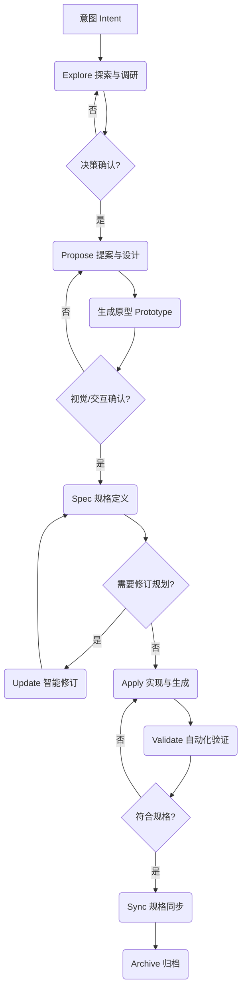

# 用 /opsx:update 完善需求：OpenSpec v1.8.0 完整工作流实践

OpenSpec v1.8.0 深度集成了 **`/opsx:update`** 技能——在变更实施过程中修订规划文档，保持 proposal/specs/design/tasks 的一致性。本文通过一个真实案例「商品搜索与价格排序」，演示完整工作流（意图 -> Explore -> Propose -> 原型 -> Update -> Spec -> Apply -> Sync -> Archive）的端到端实践。

> **前置条件**：`/opsx:update` 属于 core profile。运行 `openspec update` 后，若提示 "missing 1 core workflow: update"，执行 `openspec config profile core` 即可启用。

## 一、背景：旧版本的缺口

在早期版本的工作流中（[三大变革解读](./openspec-v1.8.0-upgrade.md)），Fluid Workflow 允许随时编辑文档，但 AI 需要被明确告知"现在要改规划"，且改动后各 artifacts 之间的连贯性无法自动保证——改了一个文档，其他文档可能不同步。

v1.8.0 强化了 `/opsx:update` 填补了这个缺口。它的职责是**修订既有 change 的规划文档并保持它们彼此一致**，且明确不修改代码。这改变了实践方式：**需求可以在实施前、实施中随时演进，而不用担心规划文档失去同步**。

```text
旧版本:  意图 -> Explore -> Propose -> 原型 -> Spec -> Apply -> Sync -> Archive
                                          ↑
                            文档修订靠手动编辑，一致性无保证

v1.8.0: 意图 -> Explore -> Propose -> 原型 -> Update (修订) -> Spec -> Apply -> Sync -> Archive
                           ↑
               标准化修订流程，保持 artifacts 一致性


```

---

## 二、实践案例：add-product-search

### 2.1 Explore：选定候选需求

在电商示例系统（Node.js + Python 双实现）中，商品列表接口 `GET /api/products` 只支持全量返回。探索后确认候选需求：

| 候选           | 取舍                                                                           |
| -------------- | ------------------------------------------------------------------------------ |
| 删除商品       | ❌ 涉及库存引用，改动大                                                        |
| 商品分页       | ❌ 需设计分页参数，偏复杂                                                      |
| **按名称搜索** | ✅ 小而有价值（~10 行代码），且修改既有 spec（MODIFIED）——正好触发 update 流程 |

### 2.2 Propose：生成规划文档

创建 change 并生成 4 个 artifacts：

- **proposal.md** — 声明 Modified Capability: `catalog-management`
- **specs/catalog-management/spec.md** — MODIFIED「商品列表查询」需求（3 个 Scenario）
- **design.md** — 过滤逻辑放服务层、大小写不敏感的包含匹配
- **tasks.md** — 4 组 8 个 checkbox

### 2.3 Update：实施前的新需求

在 apply 之前，用户提出新需求：**搜索结果支持按价格排序**。这正是 `/opsx:update` 的用武之地。

**关键判断：ADDED vs MODIFIED**：排序是新增关注点，不改变搜索的既有行为——因此用 `## ADDED Requirements` 而非 MODIFIED。这避免了 archive 时的常见陷阱：用 MODIFIED 携带部分内容会在归档时丢失主 spec 中的既有细节。

4 个 artifacts 的一致性修订：

| Artifact          | 修订                                                                                     |
| ----------------- | ---------------------------------------------------------------------------------------- |
| proposal.md       | What Changes + Impact 补充 `sort` 参数                                                   |
| specs/.../spec.md | **ADDED**「商品列表按价格排序」需求（4 个 Scenario：升序/降序/搜索+排序组合/无效值回退） |
| design.md         | 新增 Decision 3（排序参数白名单校验）+ Decision 4（排序在服务层完成）                    |
| tasks.md          | 任务签名更新为 `list(name, sort)`，测试覆盖排序场景                                      |

**白名单设计**：`sort` 只接受 `price_asc`/`price_desc`，无效值静默忽略（保持自然顺序）。静默忽略而非 400 报错，是为了向后兼容——旧客户端传未知参数不会被破坏。

### 2.4 Apply：双实现落地

按 tasks 实施，服务层负责过滤+排序，HTTP 层仅透传参数：

```javascript
// Node.js - catalog.js
list(name, sort) {
  let products = this.repo.findAll()
  if (name) {
    const keyword = name.toLowerCase()
    products = products.filter(p => p.name.toLowerCase().includes(keyword))
  }
  if (sort === 'price_asc') {
    products.sort((a, b) => a.priceCents - b.priceCents)
  } else if (sort === 'price_desc') {
    products.sort((a, b) => b.priceCents - a.priceCents)
  }
  return products
}
```

```python
# Python - catalog.py
def list_products(self, name: Optional[str] = None, sort: Optional[str] = None):
    products = self.repo.find_all()
    if name:
        keyword = name.lower()
        products = [p for p in products if keyword in p.name.lower()]
    if sort == "price_asc":
        products.sort(key=lambda p: p.price_cents)
    elif sort == "price_desc":
        products.sort(key=lambda p: p.price_cents, reverse=True)
    return products
```

**过程中发现并修复了 2 个测试逻辑错误：**

1. **Node.js 组合断言误判**：`list('a', 'price_desc')` 中 'a' 是模糊包含匹配，只有 "A" 含 'a'（B、C 不含）——修正断言为 `[300]`
2. **Python 共享 app 实例**：TestClient 复用同一 app，前面测试的商品会累积——改为相对断言（`>= 3` + 集合包含），而非硬编码数量

测试结果：Node.js 10/10、Python 4/4 全部通过。

### 2.5 Sync：智能合并到主 spec

delta spec 与主 spec 的合并遵循**智能合并**原则：

- **MODIFIED「商品列表查询」**：更新描述，保留原「获取所有商品」Scenario，新增「按名称模糊搜索」「搜索无结果」
- **ADDED「商品列表按价格排序」**：作为新 Requirement 追加

合并后主 spec 无任何 delta headers（`## ADDED/MODIFIED`），结构干净：4 个 Requirement、11 个 Scenario。

### 2.6 Archive：验证后归档

归档前验证一致性（搜索 Scenario 存在、排序 Requirement 存在、无 delta headers），然后：

```text
openspec/changes/archive/2026-07-28-add-product-search/
```

---

## 三、实践总结

### 3.1 /opsx:update 的价值

对比早期版本的手动编辑，update 流程带来三个变化：

1. **一致性保证**：修订一个 artifact 后，自动检查其他 artifacts 是否需要同步修改（"编辑方向是任意的——改后面的也可能需要改前面的"）
2. **ADDED/MODIFIED 决策显式化**：新关注点用 ADDED，行为变更用 MODIFIED——这个判断直接影响 archive 的质量
3. **不推进构建边界**：update 只改既有文件，不创建新 artifact（那是 continue 的职责）——职责划分清晰

### 3.2 版本演进的价值

从早期版本到 v1.8.0，OpenSpec 补上了工作流中最薄弱的环节。v1.8.0 解决了"AI 动态理解项目"（Schema 驱动）和"规划文档持续演进"（Update 特性）。两者结合，让 Spec-Driven Development 真正适配了**迭代开发**——需求不是一次定死的，而是与实现一起生长的。

---

_本文基于 [OpenSpec Practise](https://github.com/ForceInjection/OpenSpec-practise) 仓库的 `add-product-search` 实践（2026-07-28），完整产物见 `openspec/changes/archive/2026-07-28-add-product-search/`。_
