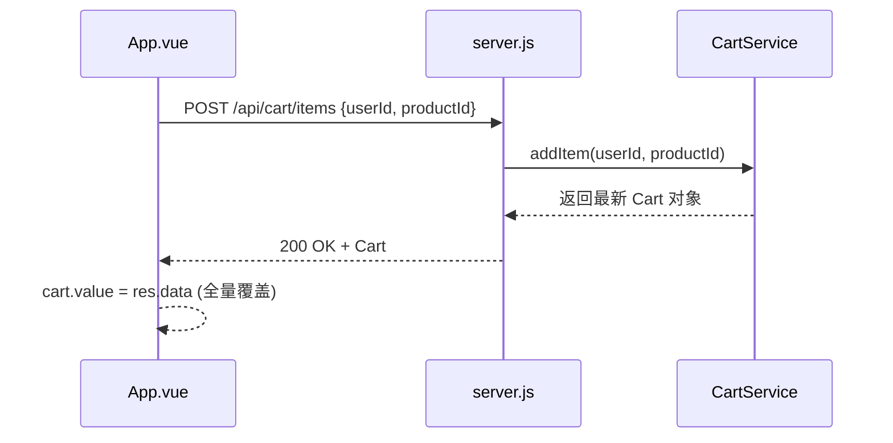

## Context

详见 `proposal.md`。当前系统在前端采用乐观更新但缺乏失败回滚机制，且 Node 后端路由层存在硬编码。

### Root Cause Analysis (RCA)
1.  **前端漂移**：`App.vue` 中的 `addToCart` 逻辑在 `try-catch` 外更新了本地 `cart` 数组，导致即使 API 报错，UI 也会显示加购成功。`removeFromCart` 根本没有调用后端接口。
2.  **Node 用户隔离失效**：`src/http/server.js` 在处理 `/api/cart/items` 时，显式声明了 `const userId = 'user_dev'`，这覆盖了可能存在的请求参数。

## Goals / Non-Goals

**Goals:**
- 实现前端与后端购物车的强一致性同步。
- 修复 Node 后端的 `userId` 硬编码问题。
- 保证结算流程使用的商品数据来自后端权威存储。

**Non-Goals:**
- 不涉及数据库持久化（仍维持内存存储）。
- 不引入 Vuex/Pinia 等复杂状态管理。

## Decisions

### 1. 服务端驱动的状态更新
- **决策**：前端在进行购物车增删操作后，直接将 API 返回的完整购物车数据覆盖本地状态，而不是在本地进行逻辑模拟。
- **理由**：后端逻辑（如库存检查、满减计算）比前端模拟更复杂且更权威。
- **替代方案**：在前端复刻后端计算逻辑。*结论：维护成本高，极易产生漂移。*

### 2. 新增同步移除接口
- **决策**：在 Node 和 Python 后端均确保存在或完善 `POST /api/cart/remove` 接口。
- **理由**：`DELETE` 方法在某些环境下的传参不便，统一使用 `POST` 携带 `userId` 和 `productId` 进行操作。

### 3. Node 路由参数透传
- **决策**：修改 `server.js`，优先从 `req.body.userId` 获取用户标识。
- **理由**：保持与 Python 版本及其他结算接口的一致性。

## Risks / Trade-offs

- **[Risk] 网络延迟导致 UI 响应慢** → **[Mitigation]** 加购/删减时增加 Loading 状态，禁止在 Pending 期间重复操作。
- **[Trade-off] 接口失败导致本地数据被回滚** → 这是为了保证一致性的必要代价，通过 UI 提示告知用户。

## 架构示意图 (State Sync)

