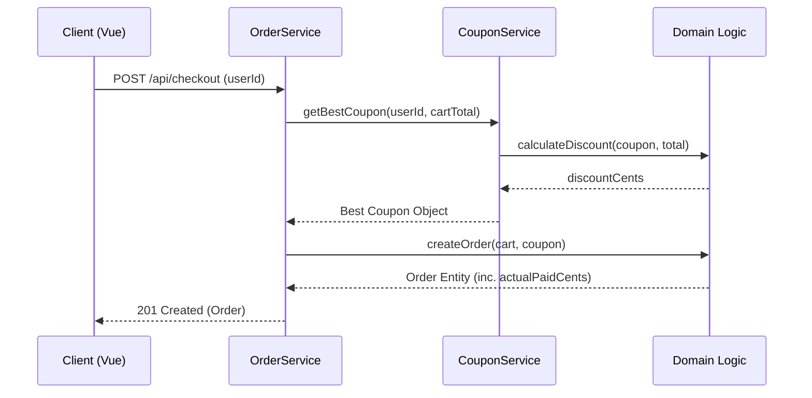

## Context

本项目是一个采用 Node.js (四层架构) 和 Python 实现的极简电商系统。目前的优惠券逻辑散落在 `CouponService` 中，仅支持固定金额减免且缺乏智能推荐逻辑。详见 [proposal.md](file:///Users/superkkk/MyCoding/OpenSpec-practice/openspec/changes/story-coupon-engine-upgrade/proposal.md)。

## Goals / Non-Goals

**Goals:**
- 引入通用的结算计算逻辑，支持 `FLAT` 和 `PERCENTAGE` 折扣。
- 实现后端权威的最优券推荐算法。
- 确保 C 端结算页面的展示与推荐逻辑一致。
- 在 `Order` 实体中增加实付金额的持久化。

**Non-Goals:**
- 不涉及数据库迁移（目前使用内存/文件存储）。
- 不涉及退款逆向流程的逻辑实现。

## Decisions

### 1. 引入策略模式处理折扣计算
**方案**: 在领域层 (`domain/logic.js`) 定义 `calculateDiscount` 函数，根据 `coupon.type` 调用不同的计算策略。
**理由**: 方便后续扩展更多优惠类型（如包邮、买一赠一），且保持领域模型的纯净。
**替代方案**: 在 Service 层硬编码逻辑（不可取，违反职责分离）。

### 2. 后端智能推荐逻辑
**方案**: 在 `CouponService` 中增加 `getBestCoupon` 方法。该方法会：
1. 过滤出用户持有且符合订单门槛的所有可用券。
2. 对每张券调用领域层的折扣计算逻辑。
3. 返回减免额最大的券对象。
**理由**: 确保推荐逻辑的权威性，防止前端计算误差。

### 3. 实付金额持久化
**方案**: 在 `Order` 实体中显式增加 `actualPaidCents` 字段，并在下单流程中强制赋值 `totalCents - discountCents`。
**理由**: 为 Phase 3 的退款（按实付退）提供数据支撑。

### 4. 前端状态管理
**方案**: 结算页组件挂载时，调用后端 API 获取“推荐券”。用户手动切换时，仅更新前端 `selectedCouponId` 并重新计算展示金额。
**理由**: 减少 API 调用，提升交互响应速度。

## 架构图 (Mermaid)

## Risks / Trade-offs

- **[Risk]** → 折扣计算出现浮点数精度问题。
- **Mitigation** → 严格使用 `priceCents` 进行计算，百分比折扣结果使用 `Math.floor` 向下取整至 cent。

- **[Risk]** → 最优券金额相同时的确定性问题。
- **Mitigation** → 算法内部增加稳定排序（按过期时间升序，ID 升序），确保推荐结果唯一。

## UI 组件层级 (与 prototype.html 对齐)

- `CheckoutPage` (Container)
  - `OrderSummary` (显示商品列表)
  - `CouponSelector` (显示可用券列表，包含“当前最优”标记)
  - `SettlementBar` (显示原价、减免、实付及提交按钮)
