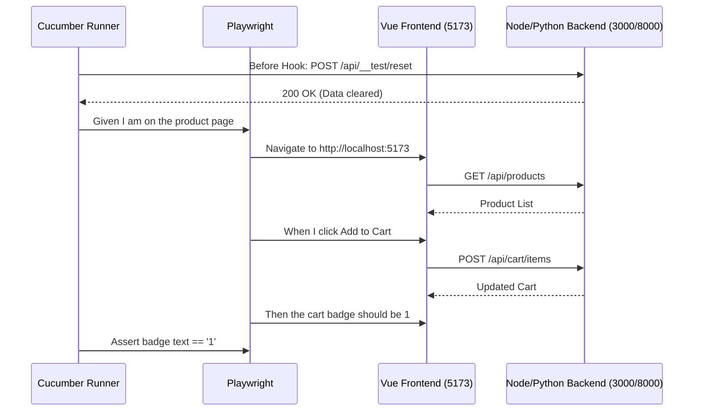

## Context

项目需要引入自动化 BDD 测试以消除归档前的人工回归测试成本。当前 `init.sh` 中的 `e2e:run` 未实现服务生命周期的闭环（即自动启动 Vue/Node/Python 并在测试结束后销毁），并且缺乏前后端的数据隔离机制。

## Goals / Non-Goals

**Goals:**
- 实现端到端测试闭环，打通 Cucumber 与 Playwright。
- 实现 E2E 测试环境下的前后端数据重置机制。
- 提取并实现 MVP 阶段核心交易链路的 E2E 自动化测试。
- `init.sh e2e:run` 能够一键拉起环境、执行测试并正确关闭环境。

**Non-Goals:**
- 本次不编写边缘分支（如各种错误输入）的 E2E 测试，这些留给 `@unit` 或 `@api` 解决。
- 本次不改动现有的任何核心业务代码逻辑。

## Decisions

### 1. 服务生命周期管理 (Service Lifecycle)
- **Decision**: 在 `e2e-tests/package.json` 中引入 `start-server-and-test` 工具（或在 `init.sh` 中使用 Bash 后台进程控制）。为保持依赖极简，我们将通过更新 `init.sh`，使用 `&` 启动后台进程并在退出时（`trap`）执行 `kill`。
- **Rationale**: 这样避免了在 Node 项目中增加不必要的复杂 npm 包，且能同时控制 Python, Node 和 Vue 三个服务。

### 2. 测试数据重置 (Test Data Reset)
- **Decision**: 在 Node.js (`ecommerce/ecommerce-mini/src/http/server.js`) 和 Python (`ecommerce/ecommerce-mini-python/src/api/server.py`) 中暴露 `POST /api/__test/reset` 接口，仅在测试环境（如 `NODE_ENV=test`）下启用。
- **Rationale**: Cucumber 在执行每个 Scenario 前 (`Before` hook) 调用此接口清空 `MemoryRepo`，保证测试的独立性和幂等性。前端通过 Vite proxy 将 `/api` 转发至 Node 后端 (3000)，因此 UI 链路测试只依赖 Node 后端的 reset；Python 端接口为双后端对等保留。
- **Alternative**: 每次测试重启服务。但重启服务太慢，直接清空内存数据结构最快。

### 3. Cucumber 钩子设计 (Cucumber Hooks)
- **Decision**: 复用已存在的 `e2e-tests/support/world.js`（不新建 hooks.js）：
  - 现有 `Before` / `After` 钩子已负责启动/关闭 Playwright `browser` 并创建 `page`（随 smoke 基础设施落地）。
  - 在现有 `Before` 钩子中追加调用后端的 `/api/__test/reset`（3000 必须成功；8000 未启动时容忍失败）。

## Architecture Diagram (E2E Flow)

## Risks / Trade-offs

- **Risk**: 端口冲突。如果机器上已经运行了这些服务，`init.sh` 会启动失败。
  - **Mitigation**: 在 `init.sh` 的 `e2e:run` 中加入端口占用检查，并在测试后确保清理。
- **Risk**: Node.js 生产环境 (`server.prod.js`) 使用了文件持久化，重置逻辑更复杂。
  - **Mitigation**: E2E 测试强制针对开发环境（内存存储）运行，以保证测试速度和易清理性。
