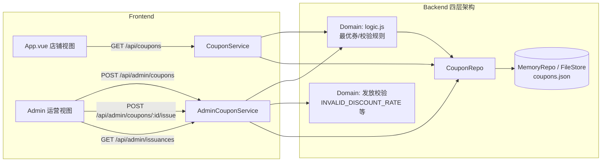

# Design: B 端极简运营后台 (story-coupon-admin-panel)

## Context

现有优惠券系统已具备 FLAT / PERCENTAGE 结算算法与最优推荐（Story 1 交付），但券数据仅来源于 `data/coupons.json` 的种子数据（全局可用、无用户归属）。本变更在既有四层架构（HTTP → Service → Domain → Repo）内补齐 B 端运营闭环。动机与范围见 `proposal.md` - Why。

当前相关实现约束：
- **Node**（`ecommerce/ecommerce-mini`）：零 npm 依赖，JSDoc 类型，`MemoryRepo`（开发）/ `FileStore`（生产）；`CouponService.getBestCoupon` 目前忽略 `userId` 全量推荐。
- **Python**（`ecommerce-mini-python`）：FastAPI + Pydantic + `MemoryRepo[T]`；`coupon.py` 与 Node 语义对齐。
- **前端**（`ecommerce-mini-frontend`）：单文件 `App.vue` 单屏 C 端店铺，无 B 端视图。
- 主规格 `coupon-management` 已声明“从用户持有的可用券中推荐”，但实现未按用户归属过滤——本变更让实现与规格对齐。

## Goals / Non-Goals

**Goals:**
- 在 Node / Python 双端各新增 4 个 admin 端点（创建规则、列表、单人发放、发放记录）。
- Coupon 实体支持可空 `userId` 归属语义，`getBestCoupon` 按“全局券 + 本人持有券”过滤。
- 前端 `App.vue` 增加 B 端运营视图，与已确认原型完全对齐。

**Non-Goals:**
- 不做券的编辑 / 停用 / 删除、批量发放、用户自助领券。
- 不做运营数据报表与退款券回滚（Roadmap 下一阶段）。
- 不改动结算引擎的金额计算与精度规则。

## Decisions

### D1: Coupon 单实体模型，`userId` 可空表达“全局券 / 已发放券”

Coupon 实体新增可空 `userId` 字段：

```jsonc
// 运营创建的规则（模板）：全局可用
{ "id": "CPN-004", "name": "新客专享满减券", "type": "FLAT", "value": 2000,
  "minSpendCents": 10000, "expiryDate": "2026-09-30", "status": "ACTIVE", "userId": null }

// 发放产生的实例：绑定目标用户
{ "id": "CPN-004-1", "name": "新客专享满减券", "type": "FLAT", "value": 2000,
  "minSpendCents": 10000, "expiryDate": "2026-09-30", "status": "UNUSED", "userId": "user_1003", "templateId": "CPN-004" }
```

- 语义：`userId === null` 为全场通用券（兼容既有种子数据，历史行为不变）；`userId` 非空为已发放实例，仅持有人可见。
- `getBestCoupon(userId, total)` 过滤条件改为 `status === 'UNUSED' && (coupon.userId === null || coupon.userId === userId)`。
- 列表“已发放数量”= 统计 `templateId === 该模板 id` 的实例数（聚合查询，不维护冗余计数，避免计数漂移）。
- **理由**：单实体最轻量，`data/coupons.json` 现有记录无需迁移（无 `userId` 视为 null）。
- **替代方案（已否决）**：CouponTemplate + UserCoupon 双实体。否决原因：当前无商品级适用范围、无多用户抢券，双实体属于过度建模，违反 Lightweight 治理原则。

### D2: 发放 = 创建用户归属实例，而非修改模板

发放动作以模板字段为蓝本创建一张新券实例（新 id、`userId`、`UNUSED`），模板本身保持 `ACTIVE` 全场可用。

- **理由**：模板可多次发放（已发放数量可累积），且已发放实例具备独立状态机（UNUSED → USED），与 `domain_model.html` 的 Coupon 状态机一致。
- **替代方案（已否决）**：直接给模板打 `userId` 标记。否决原因：会使模板从“全场通用”变为“个人专用”，破坏可复用性，且无法表达多用户发放。

### D3: Admin API 设计（Node 与 Python 保持契约一致）

```
POST   /api/admin/coupons               创建规则        { name, type, value, minSpendCents, expiryDate }
GET    /api/admin/coupons               规则列表        (含 issuedCount)
POST   /api/admin/coupons/:id/issue     单人发放        { userId }
GET    /api/admin/issuances             最近发放记录
```

- 校验规则（校验放 Domain 层，纯逻辑无 IO）：`INVALID_DISCOUNT_RATE`（PERCENTAGE 值 ≥ 10 或 ≤ 0）、`COUPON_VALUE_EXCEEDS_THRESHOLD`（FLAT 减免 ≥ 门槛）、`INVALID_USER_ID`（不匹配 `user_\d+`）、`COUPON_ALREADY_ISSUED`（同人同券重复发放）、`COUPON_NOT_ACTIVE`（非 ACTIVE 模板不可发放）。
- 发放记录：`{ id, time, couponId, couponName, userId, operator }`，追加写入，天然有序。
- **理由**：C 端 `GET /api/coupons` 保持不变（返回当前用户可见券），admin 端点与 C 端端点职责分离，避免破坏既有前端。

### D4: 前端以视图模式集成 B 端后台

`App.vue` 增加顶层状态 `viewMode: 'store' | 'admin'`，通过顶部导航入口切换；B 端视图按原型渲染四个章节（新建规则 / 券列表 / 手动发券 / 发放记录），共享既有 slate 极简样式。

- UI 组件层级（与原型对齐）：

```
App.vue
├── viewMode === 'store'  → 既有 C 端店铺视图（不变）
└── viewMode === 'admin'  → AdminCouponPanel
    ├── CouponCreateForm    （类型切换、内联校验）
    ├── CouponListTable     （「发券」联动）
    ├── CouponIssuePanel    （目标用户、成功/拒绝反馈）
    └── IssuanceLogTable    （记录回流）
```

- 状态管理：保持本地 `ref` 状态（不引入 Pinia，符合极简），数据以 admin API 响应回填；发放成功由服务端返回的更新列表回填，保证与后端一致。
- **理由**：单屏架构下新增独立页面需要引入路由或额外构建产物，视图模式切换最贴合现状且零依赖。
- **替代方案（已否决）**：独立 HTML 管理页 + 独立 dev server。否决原因：增加部署与维护成本，违背单屏极简工程约束。

## Process Delta

- `L2-02` 加载结算上下文：新增上游供给动作——运营通过后台发放券，使“读取可用优惠资源”拥有真实数据来源。该供给动作按 Lightweight 原则不建模为独立 L2 步骤，仅补充数据流语义。
- `L3-01` 识别候选券：候选集判定条件由“全部 UNUSED 券”细化为“全场通用券 + 用户持有券”。这是对既有 L3 环节输入口径的明确化，不新增流程节点。

## 架构图



## Service Blueprint Sync Assessment

- **Needs Sync: Yes**
- **Trigger Type**: `SB-<LANE>-*` capability 分布变化（运营活动获得实际支撑）
- **Evidence Source**: `story.md`、`specs/coupon-management/spec.md`、`specs/frontend-ui/spec.md`
- **Planned Baseline Update**:
  - `SB-OPS-03`：核心活动补充“手动单人发券”；`coupon-management` 描述追加“规则配置与发放归属”。
  - `SB-BACKSTAGE-03`：后台活动补充“券规则持久化与单人发放接口（/api/admin/coupons*）”。
  - 阶段与泳道结构不变，capability 状态维持“已落地”。

## Domain Boundary Impact

- **Coupon Context**：聚合边界内新增“配置（创建规则）”“发放（生成用户归属实例）”两个行为；实体字段新增 `expiryDate`、可空 `userId`、`templateId`。
- **Order / Cart Context**：无领域语义变化（结算引擎输入集变化由 Coupon 边界内过滤逻辑承载）。
- **Shared / Cross**：`frontend-ui` 新增 B 端视图，无领域语义变化。

## Domain Model Sync Assessment

- **Needs Sync: Yes**
- **Trigger Type**: Coupon 聚合结构变化 + 状态机/事件补充
- **Evidence Source**: `design.md` D1/D2、`specs/coupon-management/spec.md`
- **Planned Baseline Update**:
  - `domain_model.html` Coupon Aggregate：root 实体字段补充 `expiryDate / userId / templateId`；状态机补充发放路径（ACTIVE 模板 → 生成 UNUSED 实例）。
  - Event Storming Structure：Commands 补充 `IssueCoupon`（Coupon），Policies 补充“发放归属：实例仅对持有人可见”。

## Risks / Trade-offs

- [全局券历史语义保持] → 既有种子券（无 userId）继续全场可用，行为与现状完全一致；新规则默认 `userId: null`，语义显式。
- [发放并发导致同一用户重复领取] → 发放校验在 Domain 层做存在性检查（按 templateId + userId + UNUSED），内存/单文件存储下原子性足够；生产 FileStore 单进程写入，风险可控。
- [issuedCount 聚合遍历成本] → 券实例量级极小（运营手动发放），聚合查询可接受；若未来量级增长再引入计数缓存。
- [B 端视图与 C 端视图耦合在单文件 App.vue] → 通过 `viewMode` 隔离，组件按章节拆分保持可读；若后台复杂度上升再抽取为独立入口。

## Migration Plan

- 数据：既有 `data/coupons.json` / Python 初始券无需迁移（缺省 `userId` 视为 null，运行期按 `?? null` 归一）。
- 部署：Node / Python 各新增端点与 Service/Domain 方法，前端新增视图组件；C 端接口与行为不变，可平滑发布。
- 回滚：删除 admin 端点与前端视图入口即可回到现状；结算逻辑仅收窄候选集过滤，若需回退直接还原 `getBestCoupon` 过滤条件。

## Open Questions

无。发放归属口径（全局券 + 用户券）、单实体模型、admin 端点契约均已在本设计内定稿，不遗留可推迟的未知项。
