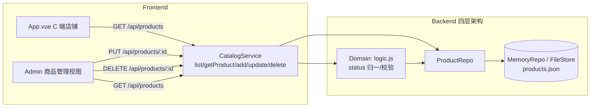

# Design: B 端商品管理 CRUD 补齐（改/删）(story-product-admin-crud)

## Context

现有 `catalog-management` 具备商品列表/搜索/排序、上架（增）、库存扣减，但**缺「改」与「删」**：`CatalogService` 无 `updateProduct`/`deleteProduct`，`server.js` 无 `PUT/DELETE` 商品路由，前端「商品管理」仅占位链接。本变更在既有四层架构（HTTP → Service → Domain → Repo）内补齐 CRUD，满足 Phase 2 Exit Criteria ②。动机与范围见 `proposal.md` - Why。

当前相关实现约束：
- **Node**（`ecommerce/ecommerce-mini`）：零 npm 依赖，JSDoc 类型；`MemoryRepo`（开发）`/FileStore`（生产 `data/*.json`）；`CatalogService.list` 目前无状态过滤；`products.json` 为空数组，前端兜底真实数据。
- **前端**（`ecommerce-mini-frontend`）：单文件 `App.vue` 单屏 C 端店铺，`viewMode` 已含 `store`/`admin`（B 端优惠券后台），「商品管理」为占位链接。

## Goals / Non-Goals

**Goals:**
- Node 端新增 `updateProduct`（改）与 `deleteProduct`（软删除）方法，及对应 `PUT`/`DELETE /api/products/:id` 路由。
- 商品实体新增 `status`（`active`/`deleted`），列表/搜索默认只返回 `active`；存量无 `status` 视为 `active`。
- 前端 `App.vue` 的 B 端视图新增商品管理页（列表 + 编辑表单 + 删除确认），与已确认原型完全对齐。
- 数据持久化落到 `data/products.json` 真实商品数据并含 `status`。

**Non-Goals:**
- 不做商品分类管理、批量改删、库存预警、导入导出。
- 不改动下单/结算/库存扣减逻辑，不做 Python 端 B 端 CRUD（降级观察）。
- 不引入 Pinia/路由等新依赖（保持极简单屏）。

## Decisions

### D1: 商品单实体模型，`status` 表达上架/下架

商品实体新增 `status` 字段（`active` / `deleted`）：`active` 为在售可购；`deleted` 为软删除（下架）。历史订单存储商品快照，故删除不破坏订单可追溯。

- **语义**：`status === 'deleted'` 的商品不进入 `list`/搜索/`getProduct`（对外）结果；库存扣减、加购等 C 端动作仅作用于 `active` 商品。
- **兼容**：存量数据无 `status` 字段，读取时按 `status ?? 'active'` 归一，历史行为不变。
- **理由**：单实体最轻量，`products.json` 现有记录无需迁移。
- **替代方案（已否决）**：`ProductActive`+`ProductArchive` 双实例或有 `isDeleted` 布尔。否决：布尔丢失"上架/下架"语义扩展性；双实例属过度建模，违反 Lightweight 治理原则。

### D2: 软删除（下架）而非物理删除

`deleteProduct(id)` 将商品 `status` 置为 `deleted` 并持久化，不物理移除记录。

- **理由**：保留历史订单/购物车引用可追溯，符合"业务闭环优先"（PRODUCT_SENSE 原则 2）；被删除商品可在未来重新上架（状态可逆）。
- **替代方案（已否决）**：物理删除。否决：破坏订单/库存审计，且`GET /api/orders/:id` 需要商品快照回查，物理删除会导致断链。

### D3: Admin API 设计（Node 补充）

```
PUT     /api/products/:id   修改商品     { name?, priceCents?, stock?, imageUrl?, description? }
DELETE  /api/products/:id   删除(下架)    —
GET     /api/products       列表/搜索     (默认仅 active；可选 name/sort)
```

- 校验（放 Domain 层，纯逻辑无 IO）：`INVALID_PRICE`（priceCents ≤ 0）、`INVALID_STOCK`（stock < 0）、`PRODUCT_NOT_FOUND`（id 不存在或已 deleted）。
- 修改为**局部更新**（patch 语义）：仅更新提供的字段；未提供的字段保持不变。
- **理由**：与既有 `POST /api/products`（上架）同域，C 端 `GET /api/products` 契约仅新增过滤，不破坏既有前端。

### D4: 前端以视图模式扩展 B 端商品管理

`App.vue` 复用既有 `viewMode: 'store' | 'admin'`，在 admin 视图内新增「商品管理」章节；用章节（section）切换商品管理与优惠券管理（当前 `viewMode` 只到 admin 层，需细化 admin 内 tab/入口）。

- UI 组件层级（与原型对齐）：

```
App.vue
├── viewMode === 'store'  → 既有 C 端店铺视图（不变）
└── viewMode === 'admin'  → AdminView
    ├── AdminCouponPanel  （既有：优惠券管理，复用）
    └── AdminProductPanel （新增：商品管理）
        ├── ProductListTable   （列表 + 编辑/删除按钮，状态过滤）
        ├── ProductEditForm    （回填、内联校验）
        └── ProductDeleteConfirm（删除确认）
```

- 状态管理：保持本地 `ref` 状态（不引入 Pinia），数据以 admin API 响应回填；修改/删除成功后由服务端返回的更新列表回填，保证与后端一致。
- **理由**：单屏架构下视图模式切换零依赖、最贴合现状。
- **替代方案（已否决）**：独立商品管理 HTML 页。否决：增加部署与维护成本，违背单屏极简工程约束。

## Process Delta

- `L1-01` 触达与发现 / `L1-02` 评估与决策：商品列表/搜索供给口径由"全部商品"收敛为"仅 active 商品"；后台改/删使 C 端元数据实时更新。这是对既有 L1 环节输入口径的明确化，不新增流程节点。
- 说明：B 端商品维护是交易主流程的上游供给动作，按 Lightweight 原则不新增价值段，仅供给既有节点。

## 架构图



## Service Blueprint Sync Assessment

- **Needs Sync: Yes**
- **Trigger Type**: `SB-<LANE>-*` capability 分布变化（运营泳道商品管理活动从"创建/查询"扩展为"修改/删除（下架）"，后台支撑补充软删除持久化）。
- **Evidence Source**: `story.md`、`specs/catalog-management/spec.md`、`specs/frontend-ui/spec.md`
- **Planned Baseline Update**:
  - `SB-OPS-01`/`SB-OPS-02`/`SB-OPS-04`：商品管理活动补充"修改"/"删除（下架）"，`catalog-management` 描述追加 CRUD 闭环。
  - `SB-BACKSTAGE-01`/`SB-BACKSTAGE-04`/`SB-BACKSTAGE-06`：后台活动补充商品 `status`（active/deleted）维护与软删除持久化。
  - 阶段与泳道结构不变，capability 状态维持"已落地"。

## Domain Boundary Impact

- **Catalog Context**：Product Aggregate 根实体新增 `status` 字段（`active`/`deleted`）与"上架/下架"状态语义；新增 `UpdateProduct`/`DeleteProduct` 行为。历史订单快照不受影响。
- **Cart / Order / Coupon Context**：无领域语义变化（商品下架不影响已入购物车快照与已下单条目；候选券依赖商品元数据，本次不改变可购校验）。
- **Shared / Cross**：`frontend-ui` 新增商品管理视图，无领域语义变化。

## Domain Model Sync Assessment

- **Needs Sync: Yes**
- **Trigger Type**: Product Aggregate 根实体属性变化（新增 `status`）+ 状态语义补充（active/deleted）。
- **Evidence Source**: `design.md` D1/D2、`specs/catalog-management/spec.md`
- **Planned Baseline Update**:
  - `domain_model.html` Product Aggregate：root 实体字段 `meta` 补充 `status`（active/deleted）；Catalog Aggregate 描述补充"上架/下架"状态语义。
  - Event Storming Structure：必要时补充 `DeleteProduct`（按软删除语义）命令/策略记录。

## Risks / Trade-offs

- [存量数据兼容] → 读时按 `status ?? 'active'` 归一，既有 `products.json` 无需迁移；C 端行为与现状一致。
- [软删除后重新上架] → 状态可逆，若未来需要"恢复上架"只需将 status 置回 active（本次不提供 UI，但模型支持）。
- [已下架商品被加购/下单引用] → C 端接口（`GET /api/products`）过滤 deleted；若购物车已含该商品快照，下单仍按快照处理，不阻断历史流程。
- [products.json 现为空数组] → 本变更补充真实商品数据并落 `status`，以符合"真实数据"底线，同时为 C 端提供真实数据源替代前端兜底。

## Migration Plan

- 数据：既有 `products.json` 商品无需迁移；读取时 `status ?? 'active'` 归一。首次启动后由种子/初始数据填充真实商品与 `status`。
- 部署：Node 新增 service 方法与路由；前端新增商品管理视图。C 端接口与行为不变，可平滑发布。
- 回滚：删除 `PUT/DELETE` 路由与前端商品管理视图即可回到现状；`list` 过滤逻辑还原为"返回全部"。

## Open Questions

无。软删除语义、`status` 字段、修改字段范围（name/priceCents/stock/imageUrl/description）、错误码（INVALID_PRICE/INVALID_STOCK/PRODUCT_NOT_FOUND）、前端交互（列表/编辑/删除确认）均已在本设计内定稿。
