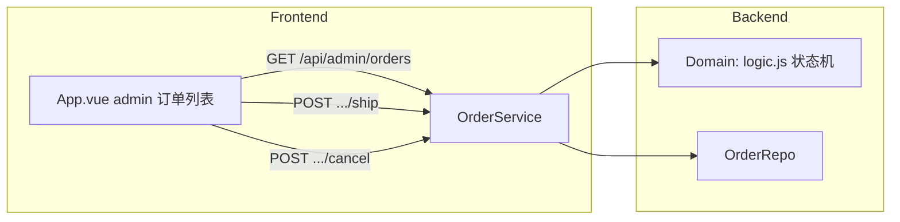

# Design: B 端订单管理 (story-order-admin)

## Context

订单已具备完整状态机（Story 1 落地：`OrderService.cancelOrder/markShipped/markCompleted` + `PaymentService.pay`），但 B 端无订单管理入口：`GET /api/orders/:id` 存在但无列表接口、无发货/取消 HTTP 端点；前端 admin 的「订单列表」为占位。

当前相关实现约束：
- **Node**：`OrderRepo` 内存 + FileStore；`OrderService` 已含状态机方法。
- **前端**：`App.vue` admin `adminTab: 'coupon' | 'product' | 'category'`；左侧导航「订单列表」无绑定。

## Goals / Non-Goals

**Goals:**
- `OrderService.listAdmin(filters)`：状态过滤 + 关键词搜索。
- `GET /api/admin/orders`、`POST /api/admin/orders/:id/ship`、`POST /api/admin/orders/:id/cancel` 路由。
- 前端 admin「订单列表」tab（列表 + 详情展开 + 发货/取消按钮）。

**Non-Goals:**
- C 端订单页（Story 3）、分页/导出/批量操作、退款/售后。

## Decisions

### D1: B 端列表接口（过滤 + 搜索）

`GET /api/admin/orders?status=&keyword=`：
- `status`：白名单过滤（ALL 缺省 = 不过滤；非法值忽略）。
- `keyword`：匹配 `order.id` 或 `order.userId`（不区分大小写包含匹配）。
- 返回摘要：`id, userId, status, actualPaidCents, totalCents, discountCents, couponId, items`（items 含商品名/单价/数量，前端详情直接可渲染）。
- **理由**：单接口支撑列表 + 详情展开，避免二次请求。

### D2: 发货/取消复用既有状态机方法

- `POST /api/admin/orders/:id/ship` → `OrderService.markShipped(id)`（PAID→SHIPPED，非法抛 `ORDER_STATUS_INVALID`）。
- `POST /api/admin/orders/:id/cancel` → `OrderService.cancelOrder(id)`（PENDING→CANCELLED，非待支付抛 `ORDER_NOT_CANCELLABLE`）。
- **理由**：不重复实现状态迁移，Story 1 已落地。

### D3: 前端 admin「订单列表」tab

- `adminTab` 增加 `'order'`；左侧导航「订单列表」绑定并高亮。
- 列表表格 + 状态过滤条（复用过滤条样式，含计数）+ 搜索框。
- 行内操作：`详情`（展开详情区）、`发货`（仅 PAID）、`取消`（仅 PENDING_PAYMENT，带确认）。
- 数据流：`fetchAdminOrders` → `GET /api/admin/orders`；发货/取消成功后重新拉取。
- **理由**：与确认后的 `order-admin.html` 原型对齐。

## Process Delta

- `L1-06` 履约与完成：发货操作（PAID→SHIPPED）落地为 B 端动作。
- `L2-05` 提交订单：B 端列表/详情查看。
- 说明：不新增流程节点，履约环节从"无操作"变为"可操作"。

## 架构图

## Service Blueprint Sync Assessment

- **Needs Sync: Yes**
- **Trigger Type**: `SB-<LANE>-*` capability 分布变化（运营泳道新增订单管理活动：查看/发货/取消）。
- **Evidence Source**: `story.md`、`specs/order-management/spec.md`
- **Planned Baseline Update**:
  - `SB-OPS-04`：运营活动补充「查看订单列表/详情」。
  - `SB-OPS-06`：运营活动补充「发货（PAID→SHIPPED）」与「取消（仅待支付）」。
  - `SB-BACKSTAGE-04`：后台活动补充 `/api/admin/orders` 与 ship/cancel 接口。
  - 阶段/泳道结构不变。

## Domain Boundary Impact

- **Order Context**：Order 聚合新增查询视角（listAdmin）与管理操作入口（ship/cancel 复用既有方法），无新领域语义。
- **Cart / Catalog / Coupon Context**：无领域语义变化。

## Domain Model Sync Assessment

- **Needs Sync: No**
- **Trigger Type**: 无 —— 本变更仅新增 B 端查询与既有状态机方法的 HTTP 入口，未改变 Bounded Context、capability taxonomy、聚合、状态机或 Policy。
- **Evidence Source**: `design.md` D1/D2、`specs/order-management/spec.md`（对比 `domain_model.html`：Order 状态机已在 Story 1 回流，无新增对象）
- **结论**: 显式 no-op —— 无需更新 `docs/baseline/domain_model.html`。

## Risks / Trade-offs

- [空列表] → 空态展示"暂无订单"。
- [操作按钮误点] → 状态显隐 + 取消带确认；接口层状态机兜底。
- [列表无分页] → 数据量小（极简演示），可接受；后续阶段 C 再做分页。

## Migration Plan

- 数据：`orders.json` 无迁移。
- 部署：`OrderService.listAdmin` + 3 条 admin 路由；前端新增 tab。既有 C 端接口不变。
- 回滚：移除 admin 路由与前端 tab 即可。

## Open Questions

无。列表过滤/搜索语义、发货/取消复用、按钮显隐均已定稿。
