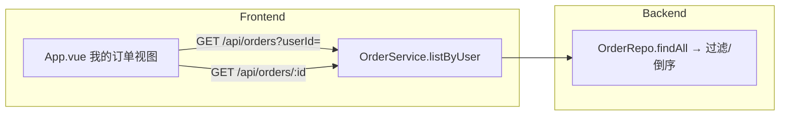

# Design: C 端订单状态展示 (story-order-customer)

## Context

买家下单/支付后无法持续查看订单状态：B 端发货（Story 2）后 C 端无从感知；下单后只有一次性弹窗（Story 1 已实现状态展示与模拟支付）。当前 `viewMode: 'store' | 'admin'`，`currentUserId` 固定 `user_dev`；`GET /api/orders/:id` 存在但无按用户查询接口。

## Goals / Non-Goals

**Goals:**
- `OrderService.listByUser(userId)` + `GET /api/orders?userId=`（倒序、归属隔离）。
- C 端「我的订单」视图（viewMode `'orders'`）：header 入口 + 列表 + 详情展开 + 状态轨迹。
- 结算成功弹窗「查看订单」按钮跳转。

**Non-Goals:**
- C 端取消订单、多用户切换、订单分页。

## Decisions

### D1: 按用户查询接口（归属隔离）

`GET /api/orders?userId=<userId>`：
- `OrderService.listByUser(userId)`：过滤 `order.userId === userId`，按创建倒序。
- **路由共存**：`server.js` 中 `GET /api/orders`（带查询参数）优先于 `GET /api/orders/:id`；判断 `url.searchParams.has('userId')` 走列表分支，否则走 `:id` 分支。
- **理由**：C 端只见自己订单（R-CUS-001）；`createdAt` 字段在创建订单时写入（新增）。

### D2: 前端 viewMode 增加 `'orders'`

- `App.vue` `viewMode: 'store' | 'orders' | 'admin'`。
- header 增加「我的订单」按钮（store/orders 可见），点击切到 orders 并 `fetchMyOrders()`。
- orders 视图：订单列表（复用 `orderStatusLabel`）+ 详情展开 + 状态轨迹（`stepOf(status)` 映射 0-3，CANCELLED 单独标注）。
- 结算成功弹窗「查看订单」→ `viewMode='orders'` + 拉取我的订单。
- **理由**：与确认后的 `order-customer.html` 原型对齐；单屏架构延续。

### D3: 订单创建写入 createdAt

- `OrderService.createOrder` 在订单对象上写入 `createdAt`（ISO 时间），列表按此倒序。
- **理由**：倒序展示需要时间戳；现有订单无该字段（读取时兜底 `createdAt ?? ''`）。

## Process Delta

- `L1-06` 履约与完成：C 端订单状态可见性补齐（买家可追踪发货/完成）。
- 说明：不新增流程节点，履约闭环的"买家可见"侧落地。

## 架构图

## Service Blueprint Sync Assessment

- **Needs Sync: Yes**
- **Trigger Type**: `SB-<LANE>-*` capability 分布变化（C 端客户动作新增"查看我的订单"）。
- **Evidence Source**: `story.md`、`specs/frontend-ui/spec.md`、`specs/order-management/spec.md`
- **Planned Baseline Update**:
  - `SB-CUSTOMER-06`：客户动作补充「查看我的订单列表与状态」。
  - `SB-BACKSTAGE-04`：后台活动补充 `GET /api/orders?userId=`。
  - 阶段/泳道结构不变。

## Domain Boundary Impact

- **Order Context**：Order 聚合新增查询视角（listByUser，只读），无领域语义变化。
- **Shared / Cross**：`frontend-ui` 新增 C 端订单视图，无领域语义变化。

## Domain Model Sync Assessment

- **Needs Sync: No**
- **Trigger Type**: 无 —— 本变更仅新增只读查询与前端视图，未改变 Bounded Context、聚合、状态机或 Policy。
- **Evidence Source**: `design.md` D1/D2、`specs/order-management/spec.md`、`specs/frontend-ui/spec.md`
- **结论**: 显式 no-op —— 无需更新 `docs/baseline/domain_model.html`。

## Risks / Trade-offs

- [路由冲突] → `GET /api/orders` 带 userId 参数优先，`:id` 分支兜底。
- [存量订单无 createdAt] → 读取时兜底，倒序中旧订单排后。
- [空订单] → 空态"暂无订单"。

## Migration Plan

- 数据：存量订单无 `createdAt`（读时兜底），新订单写入。
- 部署：`listByUser` + 路由分支；前端 orders 视图。既有接口不变。
- 回滚：移除 orders 视图与入口即可。

## Open Questions

无。归属隔离、路由共存、状态轨迹、弹窗联动均已定稿。
