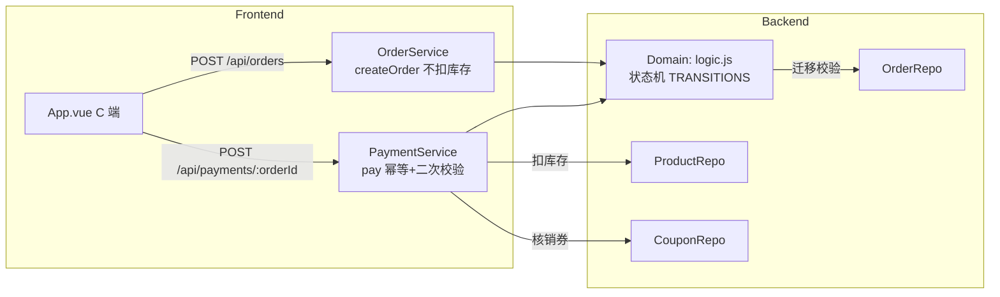

# Design: 订单状态机与模拟支付 (story-order-payment)

## Context

订单目前是无生命周期的模拟数据：下单即 `PENDING_PAYMENT` 且永不流转；`payment` 规格已定义但代码未实现（`server.js` 无 `/api/payments` 路由，无 `PaymentService`）；`OrderService.createOrder` 在**下单时即扣减库存并核销优惠券**（与 `domain_model` 的「PaymentConfirmed 后才扣」Policy 矛盾）；无取消/发货/完成语义。

当前相关实现约束：
- **Node**：`OrderService.createOrder(userId, couponId)` 含库存扣减与券核销；`CouponService` 有 `validate/redeem/getBestCoupon`；`ProductRepo/OrderRepo` 内存 + FileStore。
- **前端**：`App.vue` 结算成功弹窗（`isCheckoutSuccess` + `lastOrderId`）—— 无支付按钮。
- **主规格**：`payment`（PENDING→PAID 两态）、`order-management`（下单即扣库存）。

## Goals / Non-Goals

**Goals:**
- 订单状态机扩展：`PENDING_PAYMENT → PAID → SHIPPED → COMPLETED` / `CANCELLED`，非法迁移拒绝。
- 新增 `PaymentService.pay(orderId)`：二次校验库存 → 扣库存 → 核销券 → 状态→PAID；幂等。
- `createOrder` 移除库存扣减与券核销（仅校验库存、生成订单、清空购物车）。
- 新增 `cancelOrder`（PENDING→CANCELLED）、`markShipped`/`markCompleted`（状态机方法，供 Story 2 调用）。
- C 端结算成功弹窗新增「模拟支付」按钮与状态反馈。

**Non-Goals:**
- B 端订单管理 UI（Story 2）、C 端订单状态页（Story 3）。
- 真实支付渠道、退款、支付超时自动取消、库存锁定/预留语义（本期不做预留，支付时二次校验兜底）。

## Decisions

### D1: 订单状态机（显式迁移表）

```
PENDING_PAYMENT ──支付成功──▶ PAID ──发货──▶ SHIPPED ──完成──▶ COMPLETED
       │
       └────取消────▶ CANCELLED
```

- 合法迁移表（Domain 层 `TRANSITIONS` Map）：
  - `PENDING_PAYMENT → PAID`（支付成功）
  - `PENDING_PAYMENT → CANCELLED`（取消）
  - `PAID → SHIPPED`（发货）
  - `SHIPPED → COMPLETED`（完成）
- 非法迁移 → `ORDER_STATUS_INVALID`。
- **理由**：显式迁移表防非法流转，支付/发货/完成/取消共用同一校验。
- **替代方案（已否决）**：宽松 if 判断。否决：状态一多易漏约束。

### D2: 库存与券扣减时机迁移到"支付成功"

- `createOrder`：校验库存 → 生成订单（含快照/金额/券绑定）→ 清空购物车。**不扣库存、不核销券**。
- `pay(orderId)`：校验订单 `PENDING_PAYMENT` → **重新校验库存**（下单后可能被他人扣光）→ 扣库存 → 核销券 → 订单→PAID。
- **理由**：用户确认采用「PaymentConfirmed 后才扣」；支付时二次校验防止超卖。
- **替代方案（已否决）**：下单锁定库存（reserve 语义）。否决：增加预留/释放复杂度，本期聚焦生命周期闭环。

### D3: 幂等与错误码

- 已 `PAID` 再支付 → 返回 `ORDER_ALREADY_PAID`（HTTP 200 幂等提示，不重复扣）。
- 支付时库存不足 → `OUT_OF_STOCK`（409），订单保持 PENDING_PAYMENT，券不核销。
- 取消非 PENDING_PAYMENT → `ORDER_NOT_CANCELLABLE`。
- 状态机非法迁移 → `ORDER_STATUS_INVALID`。
- **理由**：错误码语义清晰，前端可映射中文提示。

### D4: C 端支付交互（前端）

- `App.vue` 结算成功弹窗：`PENDING_PAYMENT` 状态显示「模拟支付」按钮 → 调 `POST /api/payments/:orderId` → 成功刷新弹窗为「已支付成功，库存已扣减，等待商家发货」。
- 幂等/失败：显示对应错误提示。
- **理由**：与确认后的 `order-payment.html` 原型对齐；`API_BASE` 相对路径沿用。

## Process Delta

- `L1-04` 下单结算：创建 PENDING_PAYMENT（不扣库存）—— 输入口径修正。
- `L1-05` 支付确认：支付成功 → 扣库存 + 核销券 + PAID —— 新增支付动作落点。
- `L2-05/L2-06`、`L3-04/L3-05`：订单占用/核销时机从下单迁移到支付成功。
- 说明：不新增流程节点，修正既有节点语义。

## 架构图



## Service Blueprint Sync Assessment

- **Needs Sync: Yes**
- **Trigger Type**: `SB-<LANE>-*` capability 状态变化（支付能力从"规划中"落为"已落地"；下单语义修正）。
- **Evidence Source**: `story.md`、`specs/payment/spec.md`、`specs/order-management/spec.md`
- **Planned Baseline Update**:
  - `SB-BACKSTAGE-05`：`POST /api/payments/:orderId` 落地（状态推进 + 库存扣减 + 券核销）。
  - `SB-BACKSTAGE-04`：下单语义修正（不扣库存/不核销券）。
  - `SB-CUSTOMER-05`：C 端模拟支付交互落地。
  - 阶段/泳道结构不变。

## Domain Boundary Impact

- **Order Context**：Order 聚合状态机扩展（PAID 后新增 SHIPPED/COMPLETED，新增 CANCELLED）；支付动作成为 Order 聚合的领域命令（`PayOrder`）。库存扣减与券核销由 Order 聚合的支付命令触发（Order → Catalog / Coupon 的跨聚合协作命令）。
- **Catalog Context**：Product.stock 扣减时机从"下单"改为"支付成功"（由 Order 支付命令驱动），无领域语义变化。
- **Coupon Context**：券核销时机改为支付成功（`PayOrder` 触发 `RedeemCoupon`），无领域语义变化。

## Domain Model Sync Assessment

- **Needs Sync: Yes**
- **Trigger Type**: Order 聚合状态机扩展（SHIPPED/COMPLETED/CANCELLED）+ 库存/券扣减时机 Policy 修正（"下单即扣" → "PaymentConfirmed 后才扣"）。
- **Evidence Source**: `design.md` D1/D2、`specs/payment/spec.md`、`specs/order-management/spec.md`
- **Planned Baseline Update**:
  - `domain_model.html`：Order 状态机扩展为 `PENDING_PAYMENT → PAID → SHIPPED → COMPLETED` / `CANCELLED`；Policy「库存扣减时机」修正为"仅 PaymentConfirmed 后扣减，支付时二次校验"；优惠券核销时机同步修正。
  - Event Storming Structure：新增 `PayOrder` 命令与 `OrderPaid` / `OrderCancelled` 事件。

## Risks / Trade-offs

- [下单不扣库存 → 支付时可能不足] → 支付时二次校验（D2），不足则拒绝且订单保持 PENDING_PAYMENT。
- [购物车已清空但订单未支付] → 取消订单不回填购物车（简化，不引入回填复杂度）。
- [幂等] → 已 PAID 再支付返回提示不重复扣，避免重复扣库存/核销。
- [既有集成测试依赖"下单即扣库存"] → 需同步修正 `integration.spec.js` 断言（下单后库存不变，支付后扣减）。

## Migration Plan

- 数据：`orders.json`/`products.json`/`coupons.json` 无迁移（状态与字段透传）。
- 部署：`createOrder` 移除扣减/核销；新增 `PaymentService` 与 `/api/payments/:orderId`；前端弹窗加支付按钮。既有 C 端下单接口契约不变（除库存行为语义修正）。
- 回滚：`createOrder` 恢复扣减/核销；移除支付路由即可。

## Open Questions

无。状态机、扣减时机（支付成功）、幂等语义、取消边界、错误码均已定稿（用户已确认库存扣减方案）。
