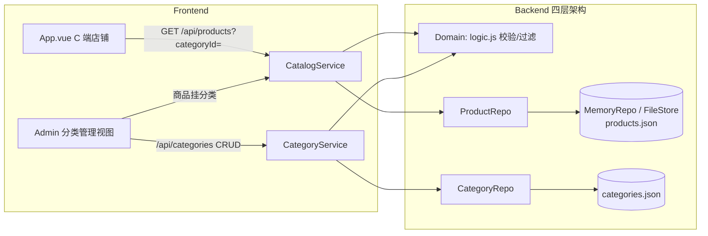

# Design: 商品分类管理 (story-product-category)

## Context

Phase 2 In Scope「商品分类管理」尚未实现。当前 `catalog-management` 无分类概念；C 端仅关键词搜索/价格排序；B 端商品管理无分类配置。`frontend-ui` 主规格「实时商品搜索」已声明支持"名称和分类"过滤，`domain_model.html` 的 Product 聚合已含 `categoryId`。本变更在既有四层架构（HTTP → Service → Domain → Repo）内补齐分类管理闭环。

当前相关实现约束：
- **Node**（`ecommerce/ecommerce-mini`）：零 npm 依赖，JSDoc；`MemoryRepo`/`FileStore`；`CatalogService.list` 支持 name/sort；商品已有 `status`（软删除，上个变更落地）。
- **前端**（`ecommerce-mini-frontend`）：单文件 `App.vue`，`viewMode: store/admin`，admin 内已有 `adminTab: 'coupon' | 'product'`。

## Goals / Non-Goals

**Goals:**
- 新增 `Category` 实体与 `CategoryService`（list/CRUD/软删除 + 删除清空商品关联）。
- Product 支持可选 `categoryId`；商品编辑可挂分类。
- `GET /api/products` 支持 `categoryId` 过滤；C 端分类筛选条。
- B 端 admin 新增「分类管理」tab。

**Non-Goals:**
- 多级分类树、分类图片/图标、拖拽排序、批量移动商品。
- Python 端同步实现（观察）。
- 不改变既有结算/库存/优惠券逻辑。

## Decisions

### D1: Category 单实体模型（平铺单层）

```jsonc
{ "id": "cat-keyboard", "name": "键鼠外设", "sortOrder": 1, "status": "active" }
```

- 字段：`id`（kebab-case 生成或自增）、`name`（必填）、`sortOrder`（缺省 0）、`status`（active/deleted）。
- **理由**：极简电商 Phase 2 不需要多级树；平铺 + sortOrder 足以表达"按品类浏览"。
- **替代方案（已否决）**：父子树（parentId）。否决：增加层级复杂度，当前无运营诉求。

### D2: 软删除 + 删除清空商品关联

`deleteCategory(id)`：分类 `status=deleted`，并将所有 `categoryId === id` 的商品 `categoryId` 置 null。

- **理由**：软删除保留分类历史可追溯；商品置空保持可售（商品快照与历史订单无关）。
- **替代方案（已否决）**：物理删除分类。否决：破坏历史引用；级联删除商品过于激进。

### D3: API 设计

```
GET    /api/categories           分类列表（active，按 sortOrder 升序）
POST   /api/categories           新增分类   { name, sortOrder? }
PUT    /api/categories/:id       编辑分类   { name?, sortOrder? }
DELETE /api/categories/:id       删除(软)   → 关联商品 categoryId 置空
GET    /api/products?categoryId= 商品列表按分类过滤（与 name/sort 组合）
```

- 校验（Domain 层）：`CATEGORY_NAME_EXISTS`（同名 active 分类，409）、`CATEGORY_NOT_FOUND`（id 不存在或已 deleted，404/400）、name 非空。
- **理由**：`/api/categories` 是独立资源端点；`GET /api/products` 扩展 `categoryId` 查询参数，向后兼容。

### D4: 前端集成

- admin：`adminTab` 增加 `'category'` 值，左侧导航「分类管理」入口（在交易管理组）。
- 商品编辑表单：增加「分类」下拉（active 分类 + 未分类 null）。
- C 端 store：商品区顶部加分类筛选条（`GET /api/categories` + 本地 `categoryId` 过滤；与 `filteredProducts` 组合）。
- **理由**：延续既有 `viewMode` + `adminTab` 单屏模式，零新依赖。

## Process Delta

- `L1-01` 触达与发现：C 端新增"按分类浏览/筛选"入口，是发现商品的新主要路径（对既有"搜索/排序"路径的补充）。
- `L1-02` 评估与决策：商品元数据增加分类维度。
- 说明：B 端分类维护是交易主流程的上游供给动作，按 Lightweight 原则不新增价值段。

## 架构图



## Service Blueprint Sync Assessment

- **Needs Sync: Yes**
- **Trigger Type**: `SB-<LANE>-*` capability 分布变化（运营泳道新增分类管理活动、C 端新增分类筛选能力）。
- **Evidence Source**: `story.md`、`specs/catalog-management/spec.md`、`specs/frontend-ui/spec.md`
- **Planned Baseline Update**:
  - `SB-OPS-01`：核心活动补充「分类维护（新增/编辑/下架）与商品挂分类」。
  - `SB-BACKSTAGE-01`：后台活动补充 `/api/categories` 持久化与商品 `categoryId` 关联。
  - `SB-CUSTOMER-01`：商品栅格/搜索交互补充「分类筛选条」。
  - 阶段与泳道结构不变，capability 状态维持"已落地"。

## Domain Boundary Impact

- **Catalog Context**：新增 `Category` 聚合（name/sortOrder/status）；Product 聚合的 `categoryId` 由预留字段落为显式关联。分类与商品同属 Catalog 边界（`domain_model.html` Product 已含 categoryId）。
- **Cart / Order / Coupon Context**：无领域语义变化。
- **Shared / Cross**：`frontend-ui` 新增分类管理界面与 C 端筛选条，无领域语义变化。

## Domain Model Sync Assessment

- **Needs Sync: Yes**
- **Trigger Type**: 新增 `Category` 聚合 + Product `categoryId` 关联显式化。
- **Evidence Source**: `design.md` D1/D2、`specs/catalog-management/spec.md`
- **Planned Baseline Update**:
  - `domain_model.html`：新增 `Category` Aggregate（root: Category(id, name, sortOrder, status)）；Product 聚合明确 `categoryId` 为对 Category 的引用。
  - Event Storming Structure：必要时补充 `CreateCategory`/`DeleteCategory` 命令。

## Risks / Trade-offs

- [存量商品无分类] → categoryId 缺省 null 视为未分类，C 端「全部」正常展示；不迁移既有数据。
- [同名分类判定] → 按 name 精确匹配（active 范围内）判重；大小写敏感，避免误判。
- [删除分类并发] → 单文件/内存存储下删除+清空原子性足够；生产 FileStore 单进程写入。
- [筛选与搜索组合性能] → 数据量极小，内存过滤可接受。

## Migration Plan

- 数据：`data/categories.json` 新建（种子分类：键鼠外设/显示设备/桌面收纳/音频设备）；`data/products.json` 商品补 `categoryId`。
- 部署：Node 新增 CategoryService 与路由；前端新增分类管理 tab + C 端筛选条。既有接口向后兼容（categoryId 可选）。
- 回滚：删除 `/api/categories` 路由与前端分类 UI 即可；`categoryId` 过滤参数多余无害。

## Open Questions

无。分类模型（平铺）、软删除语义、商品置空、唯一性规则、API 契约与前端形态均已在设计内定稿。
