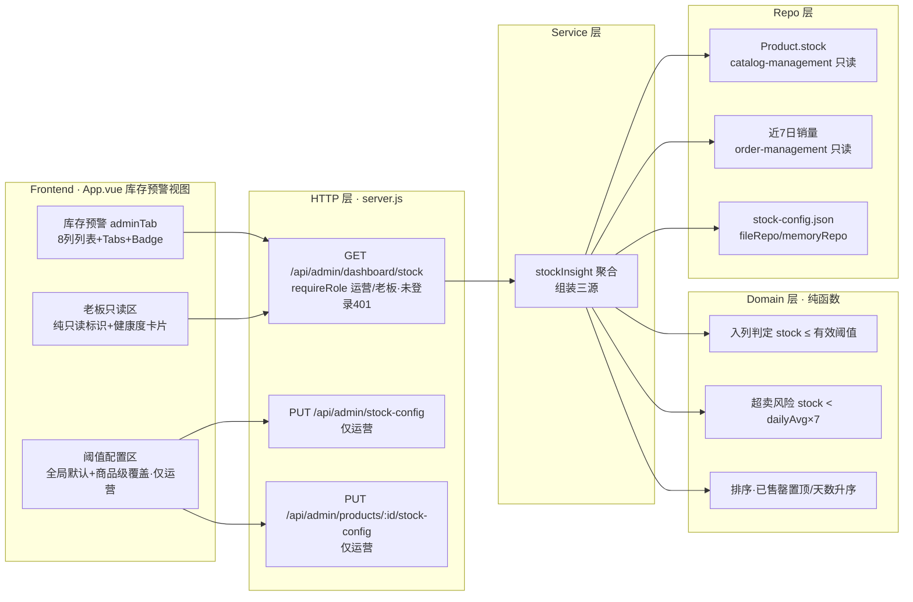

# Design: story-stock-warning-list

> 关联 proposal：`openspec/changes/story-stock-warning-list/proposal.md`
> 关联需求侧：story.md / idea.md / 原型 `stock-insight.html`（Epic 整体，已确认）
> 关联 specs：`specs/stock-insight/spec.md`（新增）、`specs/frontend-ui/spec.md`（修改）、`specs/user-admin/spec.md`（修改·轻量）

## Context (上下文)

低库存预警列表 + 阈值配置（P0 Story）：运营/老板登录 B 端后台「经营分析」分组查看预警列表（`stock ≤ 有效阈值` 自动入列，含 `stock=0` 已售罄置顶与超卖风险琥珀标识），运营可配置两级阈值（全局默认 10 件 + 商品级覆盖），配置写操作落盘 `data/stock-config.json` 即时生效。复用既有基础（见 proposal.md - Why / What）：`requireRole('运营','老板')` 白名单门禁、`resolveDashboardRange` 时间换算、`buildProductRanking` 销量聚合底座、fileRepo/memoryRepo 双实现、App.vue 运营后台单屏布局。

约束要点：预警接口为**只读聚合**（本 Epic 唯一写操作 = 阈值配置）；金额/库存一律整型；Domain 层零外部依赖；前端与确认原型完全对齐（ZAPP 语义令牌，无圆角无阴影）。

## Domain Boundary Impact (领域边界影响)

- **`data-insights`（扩展，需标注新增 taxonomy）**：新增 `stock-insight` capability——库存预警聚合与阈值配置。**归属理由**：预警聚合是"经营分析"只读域的另一面（与 `sales-dashboard` 同族：只读消费交易数据、服务运营/老板决策），归属 `data-insights` 使其与交易 BC（Catalog/Order）写路径解耦；`domain_model.html` 现有映射表（行 970 为 `bc-data-insights → cap-sales-dashboard` 唯一边）需在 Baseline Sync 补充 `bc-data-insights → cap-stock-insight`。
- **Catalog Context（只读消费）**：`Product.stock` 库存事实来源（`domain_model.html` aggregateCatalog 行 888）；不变量 `stock ≥ 0` 与库存扣减时机（行 864）零改动。
- **Order Context（只读消费）**：近7日订单销量聚合数据来源，复用 `order-management` 既有 `buildProductRanking`/`aggregateSales` 底座；订单状态流转语义零改动。
- **Shared / Cross（修改）**：`frontend-ui` 横切支撑扩展（库存预警视图，`bc-shared → cap-ui`）。
- **User Context（轻量）**：补充 `user_1003`（role=老板）种子演示账号；`role ∈ {客户, 运营, 客服, 老板}` 角色体系与既有门禁不变（对齐 `domain_model.html` 行 869 看板权限门禁）。

## Process Delta (流程影响)

- 交易主流程（L1-01~L1-06）**零改动**；L3 交易规则节点（L3-01~L3-06，下单结算）**零改动**。
- **L1-07 经营分析（只读支流）扩展**：在"销售看板"平行支流旁新增「库存洞察」支流——预警列表（入列判定 → 超卖风险标注 → 排序）＋ 阈值配置（仅运营写）。数据来源为 L1-05 支付确认（PAID 订单时间归属）与 L1-06 履约与完成（Product.stock 库存扣减事实 + 订单销量）。
- 不修改任何 L2/L3 节点的进入/退出条件；L1-07 的 owner（Data Insights BC / Order BC 只读消费 / User BC 角色门禁）不变。

## Service Blueprint Sync Assessment (服务蓝图同步评估)

- **Needs Sync: No**（本 change 级；Epic 级需 Sync——理由如下）
- **触发项（Epic 级 Yes，理由写清）**：分层 Sync 机制（change 级只做 Spec Sync `/opsx:sync`；Baseline Sync `/opsx:baseline/sync` 在 Epic 全部 Story 归档后统一执行）。本 change 为 `epic-stock-insight` 的 P0 Story 之一，单 Story 不触发基线回写，但该 Epic 完整交付后 `service_blueprint.html` 需要更新：
  1. **SB-BACKSTAGE-06**（行 1026，后台核心活动）新增「库存数据聚合」活动 + `stock-insight` 支撑 capability 节点（参照 `sales-dashboard` 支撑节点先例行 1046-1049）。
  2. **SB-STAGE-06**（行 554，成功回流）B 端聚合回查语义扩展（只读库存预警回查）。
- **计划更新部位**：`docs/baseline/service_blueprint.html` 的 SB-BACKSTAGE-06 单元格（activity-list + capability-list）；SB-STAGE-06 的 stage-note 或 B 端回查语义。
- **Evidence Source**：proposal.md「Service Blueprint Alignment」、story.md 旅程映射、specs 各能力 Governance Mapping。

## Domain Model Sync Assessment (领域模型同步评估)

- **Needs Sync: No**（本 change 级；Epic 级需 Sync——理由如下）
- **触发项（Epic 级 Yes，理由写清）**：本 change 引入基线级新增 capability taxonomy，属 Epic 级结构变化，按分层 Sync 在 Epic 全部 Story 归档后统一执行 `domain_model.html` 更新：
  1. **新增 capability taxonomy `stock-insight`**：mappingGraph 增加节点 `cap-stock-insight` + 边 `bc-data-insights → cap-stock-insight`（Governs，规则如"Data Insights 边界负责库存预警聚合与阈值配置，只读消费 Product.stock 与订单销量"）。
  2. **ReadModel 复用**：既有 `Operator 库存看板`（行 877，运营查看销量与补货状态）复用为预警列表读模型；建议在行 877 描述中补充"低库存预警/阈值水位线"语义（可选增强，非强制）。
  3. **Policy 新增**（policies 表，参照行 869/870）：`DataInsights 库存预警门禁`（预警接口仅运营/老板，配置写仅运营，未登录 401）与 `DataInsights 预警聚合口径`（入列 = stock ≤ 有效阈值；超卖风险 = 预计售罄天数 < 7；只读聚合不产生写操作）。
  4. **User Aggregate 角色字段滞后修复**：`domain_model.html` 行 926 invariant 仍写 `role ∈ {客户, 运营, 客服}`，Baseline Sync 时需补 `老板`（sales-dashboard Story 已扩展角色但基线未回流）。
- **计划更新部位**：`docs/baseline/domain_model.html` 的 mappingGraph nodes/edges、policies、readModels、User aggregate 角色 invariant。
- **Evidence Source**：proposal.md「Impacted Bounded Contexts」、story.md「治理映射对齐 - Sync Assessment: Yes」、specs Governance Mapping。

## Goals / Non-Goals

- **Goals**：预警列表聚合正确（入列/已售罄/超卖风险/排序口径严格）；阈值两级配置落盘即时生效；权限门禁（运营/老板 200，客户/客服 403，未登录 401）；老板只读视图（纯只读标识 + 健康度卡片）；前端与原型完全对齐（ZAPP 令牌、无圆角无阴影、真实中文数据）；`user_1003` 老板种子账号。
- **Non-Goals**：**不做补货建议**（建议补货量 /「无需补货」列计算）——归属 `story-stock-replenish-suggestion`（P1，依赖本 Story 底座）；不做 PENDING_PAYMENT 占用纳入超卖判定（P2）；不做 C 端任何页面改动；不做品类差异化默认阈值/自动补货（P2）；不修改 sales-dashboard 既有端点行为（未登录 403 兜底保持不动）。

## Decisions (技术决策)

1. **预警聚合实现位置**：在 `order-management` 既有聚合底座上**新增只读聚合方法** `aggregateStockInsight({ products, orders, globalThreshold, overrides })`（或等价 stock 聚合函数），由 stock 路由层组装 `Product.stock` + 近7日销量 + `stock-config` 三源。**理由**：销量来源是 OrderRepo，与 `aggregateSales`/`buildProductRanking` 同源保口径一致；阈值配置是独立横切数据，不塞进 order 域。**替代方案**：新建独立 `stockService`——否定：销量聚合与看板同底座更内聚，仅配置持久化走独立 repo。
2. **预警判定为纯函数（Domain 层）**：入列判定（`stock ≤ effectiveThreshold`）、有效阈值解析（覆盖优先）、预计售罄天数（`stock / dailyAvg`，无销量 null）、超卖风险（`0 < stock < dailyAvg×7`）、排序（已售罄置顶 → 天数升序 → 无销量置底）全部下沉到 `domain/logic.js`（或 stock 判定模块），零外部依赖 → `@unit` 直接测试，不推给 @e2e。**理由**：规则排列组合多（R-STOCK-001~010），金字塔底层优先。
3. **预警接口权限语义采用「未登录 401 / 越权 403」区分**（忠实 story R-STOCK-009 与 E2E 旅程 2 场景 2 的 401 验收）：预警/配置端点先解析会话（无有效会话 → 401 `UNAUTHORIZED`「请先登录」），再校验角色白名单（运营/老板 → 200；客户/客服 → 403 `FORBIDDEN`）。实现上在既有 `requireRole` 基础上新增严格变体（保留 UNAUTHORIZED 不吞并）或路由层先 `requireSession` 后校验角色。**替代方案**：直接复用 sales-dashboard 的 `requireRole`（未登录统一 403）——否定：story.md R-STOCK-009 明确要求未登录 401，且用户任务要求 E2E 覆盖 403/401 两种拒绝；既有 sales-dashboard 端点行为不动（防回归）。
4. **stock-config 持久化**：新增 `stockConfigRepo`（fileRepo/memoryRepo 双实现），落盘 `data/stock-config.json`（结构 `{ globalThreshold: 10, overrides: { "<productId>": <threshold> } }`）；写路由（`PUT /api/admin/stock-config`、`PUT /api/admin/products/{id}/stock-config`）仅运营可写，写后**同步内存 + 落盘**（对齐既有 fileRepo 模式），下次预警查询直接读最新值 → 即时生效、长期有效；软删除商品覆盖配置保留但聚合时过滤 `status=deleted`。
5. **建议补货量列边界**：本 Story API **返回 `daysToSellout`（预计售罄天数）**——它是 R-STOCK-003 超卖风险判定与 R-STOCK-010 排序的必需底座，E2E 旅程 1 断言其值（2.5/4 天）；**不返回 `replenish`（建议补货量）字段**（P1），前端表格按原型渲染 8 列，其中「建议补货量」列本 Story 显示「—」并保留脚注（到货周期 7 天），P1 Story 补齐计算与展示。**理由**：story.md Out of Scope 明确补货建议归属 P1，但预计售罄天数本 Story 必须计算（风险 + 排序依赖），故只切走"补货建议"产品语义。
6. **前端视图**：App.vue 新增 `adminTab === 'stock'` 分支（对齐原型）：预警列表 8 列 + Tabs + Badge + 阈值配置区（仅运营 v-if）+ 老板只读区（健康度卡片 3 指标 + 「纯只读 · 无配置入口」标识）；数据全部来自 `GET /api/admin/dashboard/stock`（前端不做 mock 计算，仅格式化展示）；角色判定复用 `isDashboardRole` 既有模式（运营/老板可见入口）。阈值展示区分「覆盖」（`--warning`）/「全局」（`text-muted-foreground`）。
7. **老板种子账号**：`initialUsers` 增加 `user_1003`（`role=老板`，昵称「李老板」），file 模式随既有种子注入逻辑（数据文件为空时注入 + `syncSequence`）；`data/users.json` 同步补录；E2E 复用该种子（只读断言）验证老板只读视角。
8. **测试分层**：`@unit`（入列/阈值覆盖/超卖风险/排序/软删除过滤——纯函数）→ `@api`（权限 200/403/401、配置写落盘即时生效、种子账号门禁）→ `@e2e`（运营主流程、配置即时生效、客服 403 导航不可见、老板只读）三层全覆盖，底层逻辑不推给 @e2e。

## 架构图

## Risks / Trade-offs

- **401/403 语义与既有端点不一致** → 预警/配置新端点采用「未登录 401 / 越权 403」，sales-dashboard 既有端点保持统一 403；两套语义并存可能造成后续困惑。缓解：design 决策 3 已记录，新增 `requireRoleStrict` 中间件注释明确语义，既有端点零改动。
- **补货建议列边界漂移** → story Out of Scope 与原型列并存，若 P1 未按序交付，前端「—」列会被误读为缺陷。缓解：前端脚注保留「到货周期 7 天（MVP）」+ 任务显式标注 P1 依赖（`story-stock-replenish-suggestion`）。
- **销量聚合口径**：近7日销量按 `paidAt` 归属（复用 sales-dashboard 口径），但 E2E 中订单为动态构造，库存/销量构造需要精确对齐 story 数据（键盘 3 件·售罄 2.5 天 → 日均销量需 1.2）。缓解：E2E 步骤用后门精确设置 `Product.stock`，订单构造保证日均销量；断言天数与排序（而非强依赖时区）。
- **配置即时生效的缓存一致性**：无缓存层，读时直接读 repo → 天然即时生效；file 模式写文件失败需返回 500 错误码。缓解：写路由 try/catch，失败返回 `CONFIG_WRITE_FAILED`。
- **老板健康度总览卡片为框架**（预警/已售罄/超卖风险数可算，但完整统计口径见 P1）→ 本 Story 只展示可算的 3 项计数，不承诺 P1 统计范围。

## Open Questions

- 无（story.md 决策口径①~⑧已定稿；E2E 验收与业务规则完整；实现细节按本 design 决策执行）。
